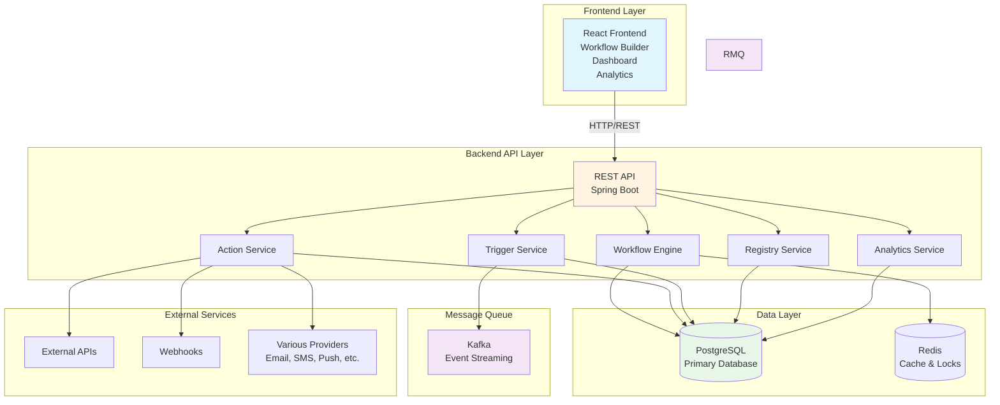
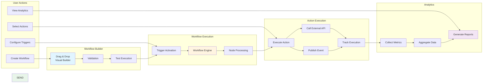

# No-Code Workflow Platform - Documentation

## 📋 Overview

This documentation describes a **No-Code Workflow Platform** that enables users (Developers and Business teams) to create, manage, and deploy workflows without writing code. The platform supports drag-and-drop workflow builder, scheduling, event-based triggers (Kafka), API integrations, and comprehensive analytics.

## 🎯 Project Goals

- **Primary Goal**: Enable non-technical users to create and manage workflows through a visual interface
- **Secondary Goal**: Provide API integration for external systems to trigger and interact with workflows
- **Target Users**: Developers and Business teams (non-technical)
- **Deployment**: On-premise
- **Scale**: Support 10M users, 10k executions/second
- **Purpose**: MVP/PoC to demonstrate the concept

## 📚 Documentation Structure

### Quick Navigation

- **[Features](./features/)** - Feature descriptions and requirements
- **[API Specifications](./api/)** - REST API endpoints and schemas
- **[Database Schema](./database-schema/)** - Data models and relationships
- **[Architecture](./architecture/)** - System design and components
- **[User Flows](./user-flows/)** - User journey and workflows
- **[Technical Specifications](./technical/)** - Frontend, Backend, and Integration specs

### Documentation Index

See [docs-index.md](./docs-index.md) for the complete import system and pattern-based documentation loading.

## 🏗️ Architecture Overview

The platform consists of:

1. **Frontend**: Web-based drag-and-drop workflow builder with dashboard and analytics
2. **Backend**: REST API, workflow engine, action execution system
3. **Message Queue**: Kafka for async processing
4. **Database**: PostgreSQL (flexible, can be changed)
5. **Scheduler**: Automated trigger system
6. **Cache**: Redis for execution context and distributed locks

### System Architecture Diagram

## 🔑 Key Features

### Core Features
- **Workflow Builder**: Drag-and-drop interface with conditional logic
- **Triggers**: Events (Kafka), schedules, API calls
- **Trigger/Action Registry**: Pre-defined triggers and actions for workflow composition
- **Action Types**: API calls, event publishing, functions, custom actions
- **Analytics**: Execution logs, tracking, and reporting
- **A/B Testing**: Support for testing different workflow variants
- **Distributed Execution**: Support for distributed pause/resume with Redis cache

### Integration Features
- **REST API**: For external systems to trigger and interact with workflows
- **Event Systems**: Kafka integration for event-based triggers and publishing
- **Scheduler**: Automated scheduled triggers
- **External APIs**: Integration with various external services and providers

### Feature Flow Diagram

## 📖 Getting Started

1. **For Requirements Analyst**: Review all documentation in this directory
2. **For Frontend Expert**: See [Frontend Technical Specs](./technical/frontend/)
3. **For Backend Expert**: See [Backend Technical Specs](./technical/backend/)
4. **For QE Expert**: See [Integration Requirements](./technical/integration/)
5. **For DevOps Expert**: See [Architecture Documentation](./architecture/)

## 📝 Documentation Standards

- All documentation is the **single source of truth**
- Use `@import()` system to reference related documentation
- Keep documentation modular and organized by category
- Update this README when adding new documentation categories

## 🔄 Documentation Categories

### Features (`docs/features/`)
- Workflow builder requirements
- Trigger and Action registry system
- Trigger mechanisms (API, Scheduler, Event - Kafka)
- Node types (Trigger, Logic, Action)
- Schema definition for workflow data
- Execution state management
- Distributed execution management
- Analytics and reporting

### API (`docs/api/`)
- REST endpoint specifications
- Request/response schemas
- Error handling
- Authentication (for future)

### Database Schema (`docs/database-schema/`)
- Entity relationships
- Table definitions
- Indexes and constraints
- Data retention policies (6 months)

### Architecture (`docs/architecture/`)
- System overview
- Component diagrams
- Integration points
- Scalability considerations

### User Flows (`docs/user-flows/`)
- User journey maps
- Workflow creation process
- Workflow execution flow
- Analytics viewing flow

### Technical (`docs/technical/`)
- Frontend specifications
- Backend specifications
- Integration requirements

### Planning (`docs/planning/`)
- Implementation plan (sprint-by-sprint)
- Backend progress tracking

## 🚀 MVP Scope

For the MVP/PoC, focus on:
- ✅ Core workflow builder functionality
- ✅ Basic action types (API Call, Publish Event, Function, Custom Actions)
- ✅ REST API for triggering workflows
- ✅ Scheduler for automated triggers
- ✅ Basic analytics dashboard
- ❌ Security features (deferred for MVP)
- ❌ Multi-tenancy (not required)
- ❌ Real-time features (not required)
- ❌ Mobile app (web only)

## 📊 Scale Requirements

- **Users**: 10 million
- **Throughput**: 10,000 executions/second
- **Deployment**: Single region (no multi-region)
- **Data Retention**: 6 months for historical data

## 🔗 Related Documentation

- [Features Overview](./features/README.md)
- [API Reference](./api/README.md)
- [Database Schema](./database-schema/README.md)
- [Architecture Design](./architecture/README.md)
- [Implementation Plan](./planning/implementation-plan.md)

