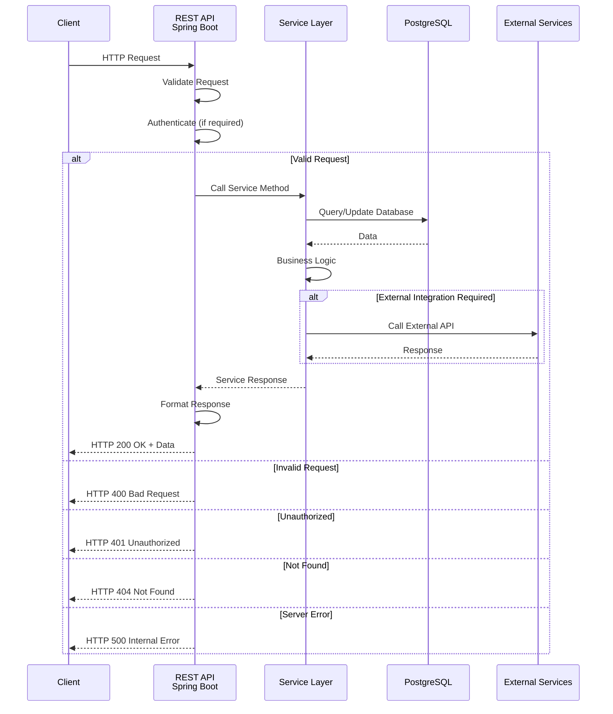

# API Endpoints

## Base URL

All endpoints are prefixed with `/api/v1`

## API Architecture Overview

### API Request Flow



## API Endpoint Categories

```mermaid
graph TB
    subgraph "Workflow APIs"
        W1[POST /workflows<br/>Create]
        W2[GET /workflows<br/>List]
        W3[GET /workflows/{id}<br/>Get]
        W4[PUT /workflows/{id}<br/>Update]
        W5[DELETE /workflows/{id}<br/>Delete]
        W6[POST /workflows/{id}/activate<br/>Activate]
    end
    
    subgraph "Registry APIs"
        R1[GET /triggers/registry<br/>Trigger Registry]
        R2[GET /actions/registry<br/>Action Registry]
    end
    
    subgraph "Trigger APIs"
        TR1[POST /workflows/{id}/triggers/api<br/>Create API Trigger]
        TR2[POST /workflows/{id}/triggers/schedule<br/>Create Schedule Trigger]
        TR3[POST /workflows/{id}/triggers/event<br/>Create Event Trigger]
        TR4[POST /trigger/{path}<br/>Trigger Workflow]
    end
    
    subgraph "Execution APIs"
        E1[GET /executions/{id}<br/>Get Execution]
        E2[GET /executions<br/>List Executions]
        E3[GET /executions/{id}/visualize<br/>Visualize]
    end
    
    subgraph "Dashboard & Report APIs"
        D1[GET /workflows/{id}/dashboard<br/>Dashboard]
        D2[GET /workflows/{id}/report<br/>Report Config]
    end
    
    style W1 fill:#e1f5ff
    style R1 fill:#fff4e1
    style TR1 fill:#e8f5e9
    style E1 fill:#f3e5f5
    style D1 fill:#fce4ec
```

## Workflows

### Create Workflow
```
POST /workflows
```

**Request Body:**
```json
{
  "name": "Welcome Email Workflow",
  "description": "Sends welcome email to new users",
  "definition": {
    "nodes": [
      {
        "id": "node-1",
        "type": "trigger",
        "subType": "api-call",
        "label": "API Trigger",
        "position": {"x": 100, "y": 100},
        "registryId": "api-trigger-standard",
        "config": {
          "endpointPath": "/api/v1/trigger/workflow-123",
          "httpMethod": "POST"
        }
      },
      {
        "id": "node-2",
        "type": "action",
        "subType": "custom-action",
        "label": "Send Email",
        "position": {"x": 300, "y": 100},
        "registryId": "send-email-action",
        "config": {
          "recipients": ["${user.email}"],
          "subject": "Welcome!",
          "body": "Hello ${user.name}"
        }
      }
    ],
    "edges": [
      {
        "id": "edge-1",
        "source": "node-1",
        "target": "node-2"
      }
    ]
  },
  "status": "draft",
  "tags": ["onboarding", "email"]
}
```

**Response:**
```json
{
  "id": "workflow-123",
  "name": "Welcome Email Workflow",
  "description": "Sends welcome email to new users",
  "definition": {...},
  "status": "draft",
  "version": 1,
  "tags": ["onboarding", "email"],
  "created_at": "2024-01-01T00:00:00Z",
  "updated_at": "2024-01-01T00:00:00Z"
}
```

**See**: `@import(features/workflow-builder.md)` for workflow definition structure.

### Get Workflow
```
GET /workflows/{id}
```

**Response:** Same as Create Workflow response with full definition.

### List Workflows
```
GET /workflows?status=active&limit=10&offset=0&search=welcome
```

**Query Parameters:**
- `status`: Filter by status (draft, active, inactive, paused, archived)
- `limit`: Number of results (default: 20, max: 100)
- `offset`: Pagination offset (default: 0)
- `search`: Search by name or description
- `tags`: Filter by tags (comma-separated)

**Response:**
```json
{
  "workflows": [
    {
      "id": "workflow-123",
      "name": "Welcome Email Workflow",
      "status": "active",
      "version": 1,
      "created_at": "2024-01-01T00:00:00Z"
    }
  ],
  "total": 100,
  "limit": 10,
  "offset": 0
}
```

### Update Workflow
```
PUT /workflows/{id}
```

**Request Body:** Same as Create Workflow

**Response:** Same as Get Workflow (creates new version)

### Delete Workflow
```
DELETE /workflows/{id}
```

**Response:**
```json
{
  "message": "Workflow deleted successfully"
}
```

### Activate Workflow
```
POST /workflows/{id}/activate
```

**Response:**
```json
{
  "id": "workflow-123",
  "status": "active",
  "message": "Workflow activated successfully"
}
```

### Deactivate Workflow
```
POST /workflows/{id}/deactivate
```

### Pause Workflow
```
POST /workflows/{id}/pause
```

### Resume Workflow
```
POST /workflows/{id}/resume
```

### Get Workflow Versions
```
GET /workflows/{id}/versions
```

**Response:**
```json
{
  "versions": [
    {
      "version": 2,
      "created_at": "2024-01-02T00:00:00Z",
      "created_by": "user-123"
    },
    {
      "version": 1,
      "created_at": "2024-01-01T00:00:00Z",
      "created_by": "user-123"
    }
  ]
}
```

### Rollback Workflow
```
POST /workflows/{id}/rollback
```

**Request Body:**
```json
{
  "version": 1
}
```

## Trigger Registry

### Get All Triggers
```
GET /triggers/registry
```

**Response:**
```json
{
  "triggers": [
    {
      "id": "api-trigger-standard",
      "name": "API Call Trigger",
      "type": "api-call",
      "description": "Receives HTTP request to start workflow",
      "configTemplate": {...},
      "metadata": {
        "icon": "api-trigger",
        "color": "#0ea5e9",
        "version": "1.0.0"
      }
    }
  ]
}
```

**See**: `@import(features/trigger-registry.md)` for trigger registry details.

### Get Trigger by ID
```
GET /triggers/registry/{id}
```

### Get Trigger by Type
```
GET /triggers/registry/type/{type}
```

**Query Parameters:**
- `type`: Trigger type (api-call, scheduler, event)

## Action Registry

### Get All Actions
```
GET /actions/registry
```

**Response:**
```json
{
  "actions": [
    {
      "id": "api-call-action-standard",
      "name": "API Call Action",
      "type": "api-call",
      "description": "Make HTTP request to external API",
      "configTemplate": {...},
      "metadata": {
        "icon": "api-call",
        "color": "#22c55e",
        "version": "1.0.0"
      }
    },
    {
      "id": "send-email-action",
      "name": "Send Email",
      "type": "custom-action",
      "actionType": "send-email",
      "description": "Send email notification",
      "configTemplate": {...},
      "metadata": {
        "icon": "email",
        "color": "#3b82f6",
        "version": "1.0.0"
      }
    }
  ]
}
```

**See**: `@import(features/action-registry.md)` for action registry details.

### Get Action by ID
```
GET /actions/registry/{id}
```

### Get Actions by Type
```
GET /actions/registry/type/{type}
```

**Query Parameters:**
- `type`: Action type (api-call, publish-event, function, custom-action)

### Get Custom Actions
```
GET /actions/registry/custom
```

## Triggers

### Create API Trigger
```
POST /workflows/{workflow_id}/triggers/api
```

**Request Body:**
```json
{
  "nodeId": "node-1",
  "registryId": "api-trigger-standard",
  "config": {
    "endpointPath": "/api/v1/trigger/workflow-123",
    "httpMethod": "POST",
    "authentication": {
      "type": "api_key",
      "key": "optional-api-key"
    },
    "requestSchema": {}
  }
}
```

**Response:**
```json
{
  "id": "trigger-123",
  "workflowId": "workflow-123",
  "nodeId": "node-1",
  "triggerType": "api-call",
  "config": {...},
  "status": "active",
  "created_at": "2024-01-01T00:00:00Z"
}
```

**See**: `@import(features/triggers.md#1-api-call-trigger)` for API trigger details.

### Create Schedule Trigger
```
POST /workflows/{workflow_id}/triggers/schedule
```

**Request Body:**
```json
{
  "nodeId": "node-1",
  "registryId": "scheduler-trigger-standard",
  "config": {
    "cronExpression": "0 9 * * *",
    "timezone": "UTC",
    "startDate": "2024-01-01T00:00:00Z",
    "endDate": null,
    "repeat": true,
    "data": {}
  }
}
```

**See**: `@import(features/triggers.md#2-scheduled-trigger)` for schedule trigger details.

### Create Event Trigger
```
POST /workflows/{workflow_id}/triggers/event
```

**Request Body:**
```json
{
  "nodeId": "node-1",
  "registryId": "kafka-event-trigger-standard",
  "config": {
    "kafka": {
      "brokers": ["localhost:9092"],
      "topic": "user.events",
      "consumerGroup": "workflow-123-consumer",
      "offset": "latest"
    },
    "schemas": [],
    "filter": {
      "eventType": "user.created"
    }
  }
}
```

**See**: `@import(features/triggers.md#3-event-trigger-kafka)` for event trigger details.

### List Triggers
```
GET /workflows/{workflow_id}/triggers
```

### Get Trigger
```
GET /triggers/{trigger_id}
```

### Update Trigger
```
PUT /triggers/{trigger_id}
```

### Delete Trigger
```
DELETE /triggers/{trigger_id}
```

### Trigger Instance Lifecycle

#### Initialize Trigger Instance
```
POST /triggers/{trigger_id}/initialize
```

#### Start Trigger Instance
```
POST /triggers/{trigger_id}/start
```

#### Pause Trigger Instance
```
POST /triggers/{trigger_id}/pause
```

#### Resume Trigger Instance
```
POST /triggers/{trigger_id}/resume
```

#### Stop Trigger Instance
```
POST /triggers/{trigger_id}/stop
```

**See**: `@import(features/trigger-registry.md#trigger-instance-lifecycle)` for lifecycle details.

### Trigger Workflow (API Trigger Endpoint)
```
POST /trigger/{trigger_path}
```

**Request Body:**
```json
{
  "data": {
    "user_id": "user-123",
    "email": "user@example.com"
  }
}
```

**Response:**
```json
{
  "workflow_id": "workflow-123",
  "execution_id": "exec-456",
  "status": "triggered",
  "message": "Workflow execution started"
}
```

## Executions

### Get Execution Details
```
GET /executions/{execution_id}
```

**Response:**
```json
{
  "id": "exec-123",
  "workflow_id": "workflow-456",
  "trigger_id": "trigger-789",
  "trigger_node_id": "node-1",
  "status": "COMPLETED",
  "started_at": "2024-01-01T00:00:00Z",
  "completed_at": "2024-01-01T00:05:00Z",
  "duration": 300000,
  "nodes_executed": 5,
  "notifications_sent": 1,
  "context": {...},
  "trigger_data": {...},
  "node_executions": [...]
}
```

**See**: `@import(features/execution-data-structure.md)` for execution data structure.

### List Executions
```
GET /executions?workflow_id={id}&status={status}&start_date={date}&end_date={date}&limit=20&offset=0
```

**Query Parameters:**
- `workflow_id`: Filter by workflow
- `status`: Filter by status (RUNNING, COMPLETED, FAILED, etc.)
- `start_date`: Filter by start date (ISO 8601)
- `end_date`: Filter by end date (ISO 8601)
- `limit`: Number of results (default: 20, max: 100)
- `offset`: Pagination offset (default: 0)

**Response:**
```json
{
  "executions": [...],
  "total": 1000,
  "limit": 20,
  "offset": 0
}
```

## Execution Visualization

### Get Execution for Visualization
```
GET /executions/{execution_id}/visualize
```

**Response:**
```json
{
  "execution": {
    "id": "exec-123",
    "workflow_id": "workflow-456",
    "status": "COMPLETED",
    "started_at": "2024-01-01T00:00:00Z",
    "completed_at": "2024-01-01T00:05:00Z"
  },
  "workflow": {
    "id": "workflow-456",
    "name": "User Onboarding Workflow",
    "definition": {
      "nodes": [...],
      "edges": [...]
    }
  },
  "trigger": {
    "type": "api",
    "data": {...}
  },
  "current_step": 0,
  "total_steps": 5,
  "nodes": [...],
  "context": {...}
}
```

**See**: `@import(features/execution-visualization.md)` for visualization details.

### Execute Next Step
```
POST /executions/{execution_id}/visualize/step
```

**Request Body:**
```json
{
  "direction": "forward"
}
```

**Response:**
```json
{
  "step_number": 2,
  "node_id": "node-2",
  "node_type": "action",
  "status": "completed",
  "execution": {...},
  "context": {...},
  "next_node": "node-3",
  "has_next": true,
  "has_previous": true
}
```

### Get Execution State at Step
```
GET /executions/{execution_id}/visualize/step/{step_number}
```

### Reset Visualization
```
POST /executions/{execution_id}/visualize/reset
```

### Get Current Context
```
GET /executions/{execution_id}/visualize/context
```

## Analytics

### Get Workflow Analytics
```
GET /analytics/workflows/{workflow_id}?start_date=2024-01-01&end_date=2024-01-31&granularity=daily
```

**Query Parameters:**
- `start_date`: Start date (ISO 8601)
- `end_date`: End date (ISO 8601)
- `granularity`: hourly, daily, weekly, monthly

**Response:**
```json
{
  "workflow_id": "workflow-123",
  "period": {
    "start": "2024-01-01T00:00:00Z",
    "end": "2024-01-31T23:59:59Z"
  },
  "metrics": {
    "total_executions": 1000,
    "successful_executions": 950,
    "failed_executions": 50,
    "average_execution_time": 2.5
  },
  "channel_breakdown": {...}
}
```

**See**: `@import(features/analytics.md)` for analytics details.

### Get Delivery Analytics
```
GET /analytics/deliveries?start_date=2024-01-01&end_date=2024-01-31&channel=email
```

### Get Channel Analytics
```
GET /analytics/channels?start_date=2024-01-01&end_date=2024-01-31
```

## Workflow Dashboard

### Get Workflow Dashboard Overview
```
GET /workflows/{workflow_id}/dashboard?start_date=2024-01-01&end_date=2024-01-31&timezone=UTC
```

**Query Parameters:**
- `start_date`: Start date (ISO 8601, optional)
- `end_date`: End date (ISO 8601, optional)
- `timezone`: Timezone (optional, default: UTC)

**Response:**
```json
{
  "workflow": {
    "id": "workflow-123",
    "name": "Welcome Email Workflow",
    "status": "active",
    "last_execution": "2024-01-31T12:00:00Z"
  },
  "metrics": {
    "total_executions": 1250,
    "successful_executions": 1200,
    "failed_executions": 50,
    "success_rate": 0.96,
    "average_execution_time": 2.5,
    "total_actions_executed": 1200,
    "action_success_rate": 0.98,
    "error_rate": 0.04
  },
  "trends": {
    "executions_change": 0.15,
    "success_rate_change": 0.02,
    "execution_time_change": -0.10
  },
  "period": {
    "start": "2024-01-01T00:00:00Z",
    "end": "2024-01-31T23:59:59Z"
  }
}
```

**See**: `@import(features/workflow-dashboard.md)` for dashboard details.

### Get Workflow Execution Trends
```
GET /workflows/{workflow_id}/dashboard/trends?start_date=2024-01-01&end_date=2024-01-31&granularity=daily
```

### Get Workflow Node Performance
```
GET /workflows/{workflow_id}/dashboard/nodes?start_date=2024-01-01&end_date=2024-01-31
```

### Get Workflow Channel Performance
```
GET /workflows/{workflow_id}/dashboard/channels?start_date=2024-01-01&end_date=2024-01-31
```

### Get Workflow Execution History
```
GET /workflows/{workflow_id}/dashboard/executions?status=completed&limit=20&offset=0&start_date=2024-01-01&end_date=2024-01-31
```

### Get Workflow Error Analysis
```
GET /workflows/{workflow_id}/dashboard/errors?start_date=2024-01-01&end_date=2024-01-31&limit=50&offset=0
```

## Workflow Reports

### Get Workflow Report Configuration
```
GET /workflows/{workflow_id}/report
```

**Response:**
```json
{
  "id": "report-123",
  "workflow_id": "workflow-123",
  "name": "Welcome Email Workflow - Daily Report",
  "analyst_query": "SELECT COUNT(*) as total_executions, AVG(duration) as avg_duration FROM executions WHERE workflow_id = :workflow_id AND started_at BETWEEN :start_date AND :end_date",
  "period_type": "last_24h",
  "period_start_date": null,
  "period_end_date": null,
  "schedule_cron": "0 9 * * *",
  "recipients": ["business@example.com", "manager@example.com"],
  "format": "csv",
  "timezone": "Asia/Ho_Chi_Minh",
  "status": "active",
  "last_generated_at": "2024-01-31T09:00:00Z",
  "next_generation_at": "2024-02-01T09:00:00Z",
  "last_generation_status": "success",
  "last_generation_error": null,
  "generation_count": 30
}
```

**See**: `@import(features/workflow-report.md)` for report details.

### Create Workflow Report Configuration
```
POST /workflows/{workflow_id}/report
```

**Request Body:**
```json
{
  "name": "Welcome Email Workflow - Daily Report",
  "analyst_query": "SELECT COUNT(*) as total_executions, AVG(duration) as avg_duration FROM executions WHERE workflow_id = :workflow_id AND started_at BETWEEN :start_date AND :end_date",
  "period_type": "last_24h",
  "period_start_date": null,
  "period_end_date": null,
  "schedule_cron": "0 9 * * *",
  "recipients": ["business@example.com", "manager@example.com"],
  "format": "csv",
  "timezone": "Asia/Ho_Chi_Minh",
  "status": "active"
}
```

**Note**: 
- `analyst_query`: SQL query with parameters `:workflow_id`, `:start_date`, `:end_date`
- `period_type`: 'last_24h', 'last_7d', 'last_30d', 'last_90d', or 'custom'
- If `period_type` is 'custom', `period_start_date` and `period_end_date` must be provided
- `schedule_cron`: Cron expression (e.g., "0 9 * * *" for daily at 9:00 AM)

### Update Workflow Report Configuration
```
PUT /workflows/{workflow_id}/report
```

### Delete Workflow Report Configuration
```
DELETE /workflows/{workflow_id}/report
```

### Generate Workflow Report (Manual)
```
POST /workflows/{workflow_id}/report/generate
```

**Request Body (Optional):**
```json
{
  "period_start": "2024-01-01T00:00:00Z",
  "period_end": "2024-01-31T23:59:59Z"
}
```

### Preview Workflow Report
```
POST /workflows/{workflow_id}/report/preview
```

**Request Body (Optional):**
```json
{
  "analyst_query": "SELECT COUNT(*) as total_executions FROM executions WHERE workflow_id = :workflow_id AND started_at BETWEEN :start_date AND :end_date",
  "period_start": "2024-01-01T00:00:00Z",
  "period_end": "2024-01-31T23:59:59Z"
}
```

**Response:**
```json
{
  "query": "SELECT COUNT(*) as total_executions FROM executions WHERE workflow_id = :workflow_id AND started_at BETWEEN :start_date AND :end_date",
  "parameters": {
    "workflow_id": "workflow-123",
    "start_date": "2024-01-01T00:00:00Z",
    "end_date": "2024-01-31T23:59:59Z"
  },
  "results": [
    {
      "total_executions": 1250
    }
  ],
  "row_count": 1,
  "execution_time_ms": 45
}
```

### Validate Analyst Query
```
POST /workflows/{workflow_id}/report/validate
```

**Request Body:**
```json
{
  "analyst_query": "SELECT COUNT(*) FROM executions WHERE workflow_id = :workflow_id AND started_at BETWEEN :start_date AND :end_date"
}
```

**Response:**
```json
{
  "valid": true,
  "error": null
}
```

**Error Response:**
```json
{
  "valid": false,
  "error": "Syntax error at line 1: unexpected token 'FROM'"
}
```

### Get Workflow Report History
```
GET /workflows/{workflow_id}/report/history?limit=20&offset=0
```

### Download Workflow Report
```
GET /workflows/{workflow_id}/report/history/{report_id}/download
```

### Update Workflow Report Status
```
PATCH /workflows/{workflow_id}/report/status
```

**Request Body:**
```json
{
  "status": "paused"
}
```

## Callback Endpoints

### API Callback
```
POST /callback/api/{correlation_id}
```

**Request Body:**
```json
{
  "data": {...}
}
```

**See**: `@import(technical/integration/async-event-aggregation.md)` for callback details.

### Kafka Event Callback
```
POST /callback/kafka/{correlation_id}
```

**Request Body:**
```json
{
  "data": {...}
}
```

## Related Documentation

- `@import(api/schemas.md)` - Request/response schemas
- `@import(api/error-handling.md)` - Error handling
- `@import(features/workflow-builder.md)` - Workflow builder
- `@import(features/trigger-registry.md)` - Trigger registry
- `@import(features/action-registry.md)` - Action registry
- `@import(features/workflow-dashboard.md)` - Workflow dashboard
- `@import(features/workflow-report.md)` - Workflow report
