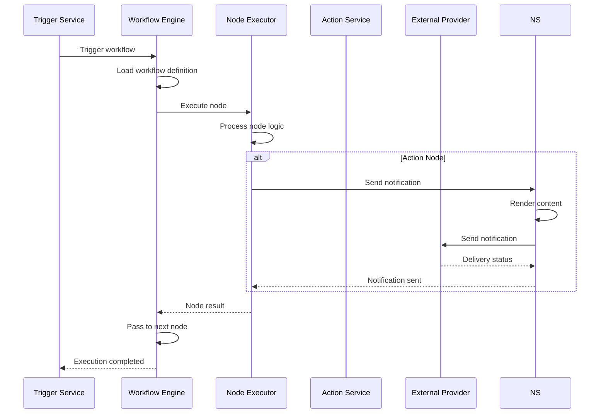
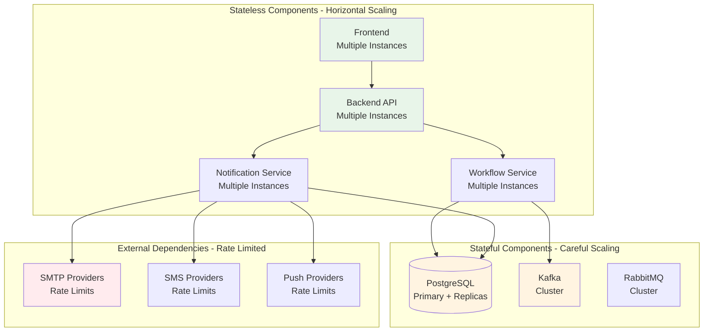

# System Components

## Frontend Components

### Workflow Builder
- **Purpose**: Visual drag-and-drop interface for creating workflows
- **Technology**: React with drag-and-drop library
- **Features**:
  - Node palette with draggable components
  - Canvas for workflow design
  - Node property editor
  - Workflow validation
  - Preview and testing

### Dashboard
- **Purpose**: Overview and management interface
- **Features**:
  - Workflow list and management
  - Quick stats and metrics
  - Recent activity
  - System health status

### Analytics Interface
- **Purpose**: View analytics and reports
- **Features**:
  - Charts and graphs
  - Filtering and date ranges
  - Export functionality
  - Custom reports

### Registry Management Interface
- **Purpose**: Manage trigger and action definitions in registry
- **Features**:
  - Trigger registry list and management
  - Action registry list and management
  - Registry definition editor
  - Enable/disable registry items

## Backend Components

### Workflow Service
- **Purpose**: Manage workflow definitions and execution
- **Responsibilities**:
  - CRUD operations for workflows
  - Workflow validation
  - Workflow execution engine
  - Node execution logic
  - Data transformation

### Action Service
- **Purpose**: Execute actions in workflows
- **Responsibilities**:
  - Execute API call actions
  - Publish events to Kafka
  - Execute function actions (calculations)
  - Execute custom actions (send-email, send-sms, etc.)
  - Handle action errors and retries
  - Track action execution results

### Trigger Service
- **Purpose**: Manage workflow triggers and trigger instances
- **Responsibilities**:
  - API trigger endpoints
  - Schedule trigger management
  - Event trigger consumers (Kafka)
  - Trigger instance lifecycle management (init, start, pause, resume, stop, destroy)
  - Trigger validation

### Analytics Service
- **Purpose**: Collect and aggregate analytics
- **Responsibilities**:
  - Collect execution metrics
  - Aggregate delivery data
  - Generate reports
  - Data retention management

### Scheduler Service
- **Purpose**: Handle scheduled triggers
- **Responsibilities**:
  - Cron expression parsing
  - Schedule management
  - Trigger execution
  - Timezone handling
  - Resume paused executions (delay nodes)

### Registry Service
- **Purpose**: Manage trigger and action definitions in the registry
- **Responsibilities**:
  - CRUD operations for trigger definitions
  - CRUD operations for action definitions
  - Registry validation
  - Enable/disable registry items
  - Version management for registry items

## Data Components

### Database (PostgreSQL)
- **Purpose**: Primary data storage
- **Tables**: See [Database Schema](../database-schema/entities.md)
- **Responsibilities**:
  - Workflow definitions
  - Trigger and Action registry definitions
  - Trigger instances
  - Execution records (with comprehensive JSONB data)
  - Node execution records (with input/output JSONB data)
  - Delivery logs
  - Analytics data

### Cache (Redis)
- **Purpose**: Cache for active execution contexts and distributed locks
- **Responsibilities**:
  - Cache active execution contexts (during execution)
  - Distributed locks for execution state updates
  - TTL-based expiration for cached contexts
  - Support for distributed pause/resume

## Message Queue Components

### Kafka Consumer
- **Purpose**: Consume events from Kafka
- **Responsibilities**:
  - Subscribe to topics
  - Process events
  - Trigger workflows
  - Error handling

## External Integration Components

### Email Provider
- **SMTP**: Direct SMTP connection
- **SendGrid**: SendGrid API integration
- **Mailgun**: Mailgun API integration
- **AWS SES**: AWS SES integration

### SMS Provider
- **Twilio**: Twilio API integration
- **AWS SNS**: AWS SNS integration
- **Vonage**: Vonage API integration

### Push Provider
- **FCM**: Firebase Cloud Messaging
- **APNs**: Apple Push Notification service
- **Web Push**: Browser push notifications

### Collaboration Providers
- **Slack**: Slack API integration
- **Discord**: Discord API integration
- **Teams**: Microsoft Teams integration

## Component Interactions

### Workflow Execution



    
```

### Analytics Collection

```mermaid
graph LR
    subgraph "Data Sources"
        EXEC[Workflow Executions]
        DELIV[Deliveries]
        NODES[Node Executions]
    end
    
    subgraph "Analytics Service"
        COLLECT[Collect Metrics]
        AGG[Aggregate Data]
        STORE[Store Analytics]
    end
    
    subgraph "Database"
        ANALYTICS[(analytics_daily table)]
    end
    
    subgraph "API"
        API[Analytics API]
    end
    
    EXEC --> COLLECT
    DELIV --> COLLECT
    NODES --> COLLECT
    
    COLLECT --> AGG
    AGG --> STORE
    STORE --> ANALYTICS
    ANALYTICS --> API
    
    style COLLECT fill:#e1f5ff
    style AGG fill:#fff4e1
    style ANALYTICS fill:#e8f5e9
```

## Component Scalability

### Component Scalability Diagram



### Stateless Components
- Frontend
- Backend API services
- Can scale horizontally

### Stateful Components
- Database (PostgreSQL)
- Redis cache
- Message queues (Kafka)
- Require careful scaling

### External Dependencies
- External providers
- Rate limits
- Connection pooling

## Component Deployment

### Frontend
- Static files served by web server
- Or containerized application
- Load balanced for high availability

### Backend Services
- Containerized microservices
- Or monolithic application
- Horizontal scaling
- Load balanced

### Data Layer
- Database with read replicas
- Redis cluster for caching and distributed locks
- Message queues (Kafka) with clustering

## Related Documentation

- [System Overview](./overview.md) - High-level architecture
- [Integrations](./integrations.md) - External integrations
- [Scalability](./scalability.md) - Scalability details


