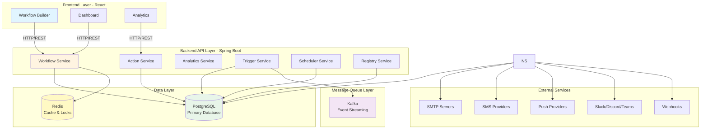
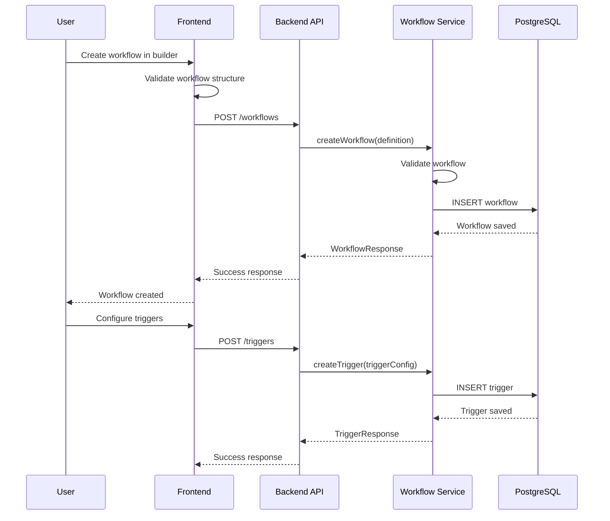
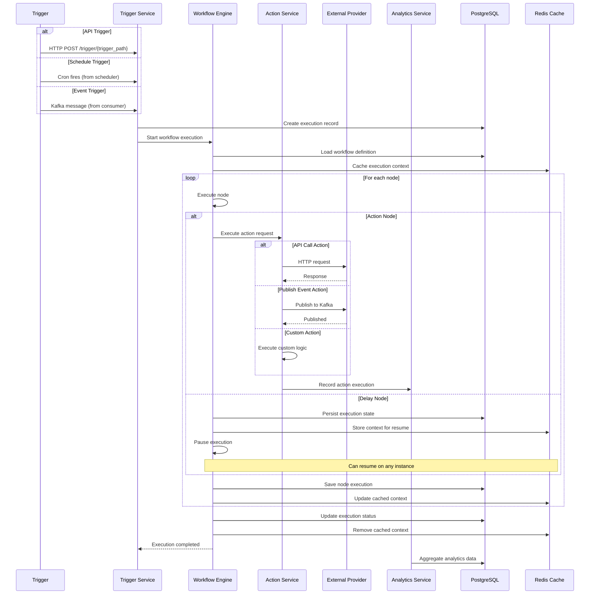
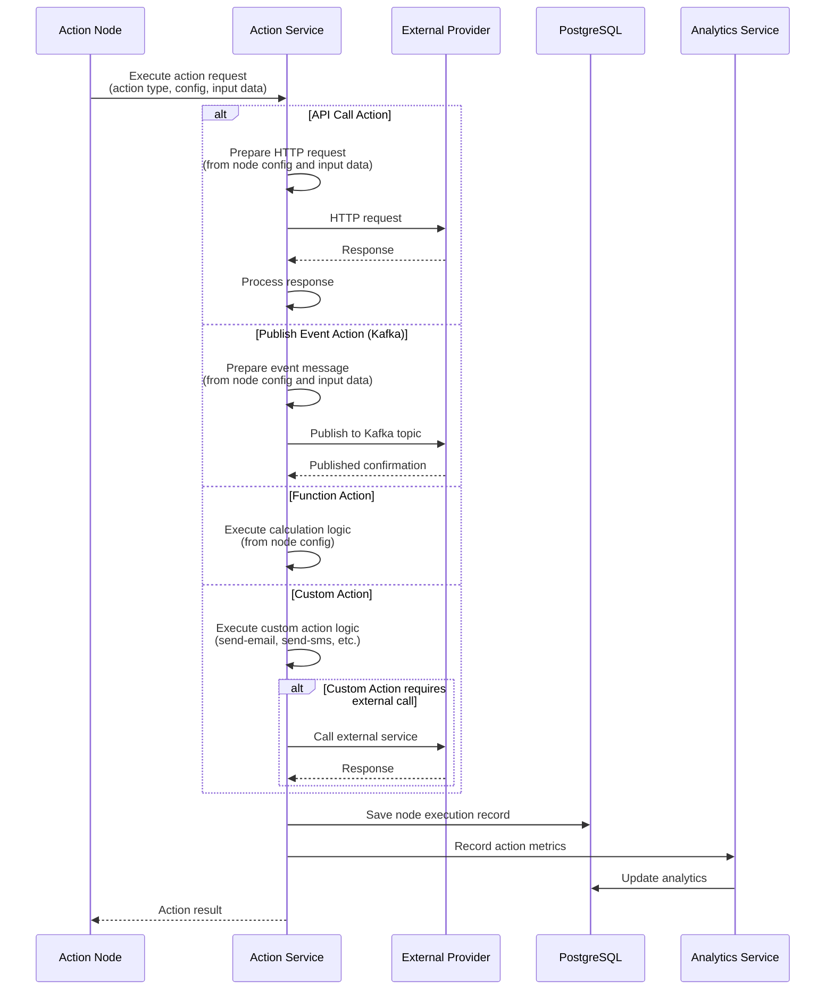
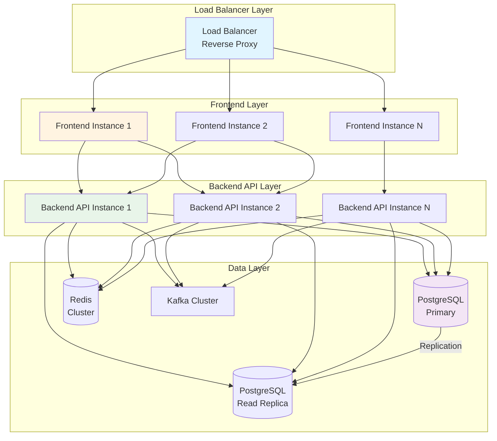

# System Architecture Overview

## High-Level Architecture

## System Components

### 1. Frontend Layer
- **Workflow Builder**: Drag-and-drop interface for creating workflows
- **Dashboard**: Overview and management interface
- **Analytics**: Reporting and insights interface

### 2. Backend API Layer
- **Workflow Service**: Manages workflow definitions and execution
- **Action Service**: Executes actions (API calls, event publishing, custom actions)
- **Trigger Service**: Manages workflow triggers and trigger instances
- **Analytics Service**: Collects and aggregates analytics data
- **Scheduler Service**: Handles scheduled triggers
- **Registry Service**: Manages trigger and action definitions in the registry

### 3. Data Layer
- **PostgreSQL**: Primary database for all data
- **Redis**: Cache for active execution contexts and distributed locks

### 4. Message Queue Layer
- **Kafka**: Event streaming for event triggers

### 5. External Services
- **External APIs**: Various REST APIs for integration
- **Webhooks**: HTTP webhook endpoints
- **Message Brokers**: Kafka for event publishing
- **Providers**: Email, SMS, Push, Slack, Discord, Teams providers (via custom actions)

## Data Flow

### Workflow Creation Flow

### Workflow Execution Flow

### Action Execution Flow

## Communication Patterns

### Synchronous Communication
- **Frontend ↔ Backend API**: HTTP/REST
- **Backend API ↔ Database**: Direct connection
- **Backend API ↔ External Providers**: HTTP/REST

### Asynchronous Communication
- **Event Triggers**: Kafka consumers
- **Event Publishing**: Kafka producers for publishing events
- **Analytics Processing**: Async aggregation

## Scalability Considerations

### Horizontal Scaling
- **Frontend**: Stateless, can scale horizontally
- **Backend API**: Stateless, can scale horizontally
- **Database**: Read replicas for read scaling
- **Message Queue**: Partitioned topics/queues

### Vertical Scaling
- **Database**: Increase resources for larger datasets
- **Message Queue**: Increase broker resources

### Caching Strategy
- **Workflow Definitions**: Cache frequently accessed workflows
- **Trigger/Action Registry**: Cache registry definitions
- **Execution Context**: Cache active execution contexts in Redis for distributed pause/resume
- **Distributed Locks**: Use Redis for distributed locks during execution state updates

### Load Balancing
- **Frontend**: Load balancer for multiple instances
- **Backend API**: Load balancer for API instances
- **Database**: Connection pooling

## Deployment Architecture

### On-Premise Deployment

## Security Considerations (Future)

### Authentication
- API key authentication (optional for MVP)
- OAuth 2.0 (future)
- SSO integration (future)

### Authorization
- Role-based access control (future)
- Resource-level permissions (future)

### Data Protection
- Encryption at rest (future)
- Encryption in transit (TLS/SSL)
- Secure credential storage (future)

## Monitoring and Observability

### Logging
- Application logs
- Access logs
- Error logs
- Execution logs

### Metrics
- Request rates
- Error rates
- Execution times
- Delivery rates
- Queue depths

### Health Checks
- API health endpoints
- Database connectivity
- Message queue connectivity
- External provider status

## Related Documentation

- [Components](./components.md) - Detailed component descriptions
- [Integrations](./integrations.md) - External integrations
- [Scalability](./scalability.md) - Scalability details

