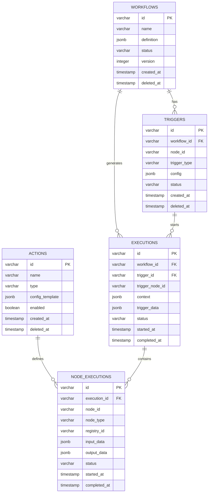
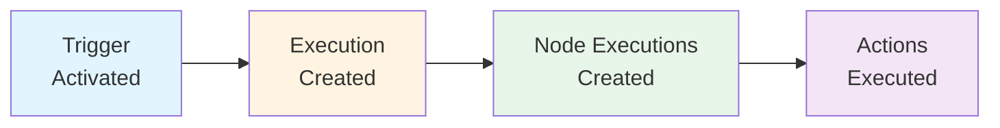
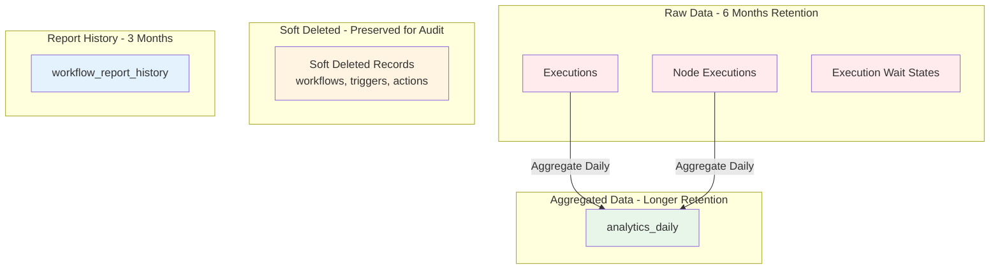

# Entity Relationships

Tài liệu này giải thích các mối quan hệ giữa các bảng trong database của hệ thống No-Code Workflow Platform.

## Tổng quan các mối quan hệ

Hệ thống có 5 nhóm thực thể chính và các mối quan hệ giữa chúng:

1. **Registry Layer** (Lớp đăng ký): `actions` (trigger types hardcoded in code)
   - Chứa các định nghĩa action có thể tái sử dụng
   - Trigger types được hardcode trong code (api-call, scheduler, event)

2. **Workflow Layer** (Lớp workflow): `workflows`, `triggers`
   - Chứa các workflow do người dùng tạo
   - Mỗi workflow có thể có nhiều trigger configs (mỗi trigger node có 1 config)
   - **Note**: Triggers chỉ là config, không tự động hoạt động. Chỉ hoạt động khi trigger node được thêm vào workflow và workflow được activate.

3. **Execution Layer** (Lớp thực thi): `executions`, `node_executions`, `execution_wait_states`
   - Chứa dữ liệu thực thi workflow
   - Lưu trữ lịch sử và dữ liệu để phân tích

4. **Analytics Layer** (Lớp phân tích): `analytics_daily`
   - Chứa dữ liệu tổng hợp hàng ngày

5. **Reporting Layer** (Lớp báo cáo): `workflow_reports`, `workflow_report_history`
   - Chứa cấu hình và lịch sử báo cáo tự động

## Relationship Diagram

### Entity Relationship Diagram (ERD)



### Simplified Relationship Diagram

```
workflows (1) ──< (N) triggers
workflows (1) ──< (N) executions

actions (1) ──< (N) node_executions (via registry_id)

triggers (1) ──< (N) executions

executions (1) ──< (N) node_executions
```

## Detailed Relationships

### 1. Workflows → Trigger Instances (via workflow definition)
- **Relationship**: One-to-Many (Một-Nhiều) - Logic relationship through workflow definition
- **Foreign Key**: None (trigger instances stored in `workflows.definition` JSONB)
- **Description**: 
  - Một workflow có thể có nhiều trigger instances (mỗi trigger node trong workflow có một instance)
  - Trigger instances được lưu trong `workflows.definition` node data, không có bảng riêng
  - Ví dụ: Workflow "Email Marketing" có thể có 2 trigger instances: một cho "API Call Trigger Config" và một cho "Scheduler Trigger Config"
  - **Important**: Trigger instances reference trigger configs via `triggerConfigId`. Trigger configs là độc lập và có thể share giữa nhiều workflows.
- **Business Logic**: 
  - Khi user thêm trigger node vào workflow → tạo trigger instance trong workflow definition
  - Khi user xóa trigger node → xóa trigger instance từ workflow definition (không ảnh hưởng trigger config)
  - Khi user xóa workflow → trigger instances bị xóa cùng workflow definition (nhưng trigger configs vẫn tồn tại)
  - Runtime state (ACTIVE, PAUSED, etc.) được lưu trong workflow definition

### 2. Trigger Configs → Executions
- **Relationship**: One-to-Many (Một-Nhiều) - Logic relationship
- **Foreign Key**: `executions.trigger_id` → `triggers.id` (reference to trigger config)
- **Cascade**: None (Không cascade - giữ lại executions)
- **Description**: 
  - Một trigger config có thể khởi động nhiều executions (qua các trigger instances trong workflows)
  - Ví dụ: Scheduler trigger config được dùng trong 3 workflows, mỗi workflow chạy mỗi ngày → tạo 1095 executions trong một năm (365 x 3)
- **Business Logic**: 
  - Khi trigger instance trong workflow được kích hoạt → tạo execution mới với `trigger_id` reference đến trigger config
  - Cho phép tracking: trigger config nào đã tạo bao nhiêu executions
  - Có thể phân tích hiệu suất của từng trigger config

### 3. Actions → Node Executions
- **Relationship**: One-to-Many (Một-Nhiều) - Quan hệ logic qua `registry_id`
- **Foreign Key**: Không có foreign key trực tiếp, sử dụng `node_executions.registry_id` để tham chiếu đến `actions.id`
- **Description**: 
  - Một action có thể được sử dụng trong nhiều node executions
  - Ví dụ: Action "Send Email" có thể được thực thi hàng nghìn lần trong các execution khác nhau
- **Business Logic**: 
  - Actions là "template" có thể tái sử dụng
  - Khi workflow execution chạy → tạo node executions với `registry_id` tham chiếu đến action
  - Cho phép tracking: bao nhiêu lần một action được thực thi

### 4. Workflows → Executions
- **Relationship**: One-to-Many (Một-Nhiều)
- **Foreign Key**: `executions.workflow_id` → `workflows.id`
- **Cascade**: None (Không cascade - giữ lại executions để lưu lịch sử)
- **Description**: 
  - Một workflow có thể có nhiều execution records (mỗi lần workflow chạy tạo một execution)
  - Ví dụ: Workflow "Daily Report" có thể có hàng nghìn executions (mỗi ngày một lần)
- **Business Logic**: 
  - Khi trigger node trong workflow được kích hoạt → tạo execution mới
  - Executions được giữ lại để phân tích, báo cáo, troubleshooting
  - Không xóa executions khi xóa workflow (giữ lịch sử)

### 6. Executions → Node Executions
- **Relationship**: One-to-Many (Một-Nhiều)
- **Foreign Key**: `node_executions.execution_id` → `executions.id`
- **Cascade**: ON DELETE CASCADE (Khi xóa execution, tự động xóa các node executions)
- **Description**: 
  - Một execution chứa nhiều node executions (mỗi node trong workflow được thực thi tạo một node execution)
  - Ví dụ: Execution của workflow có 5 nodes → tạo 5 node executions
- **Business Logic**: 
  - Khi execution chạy qua các nodes → tạo node execution cho mỗi node
  - Node executions lưu trữ input/output data, errors, retry information
  - Cho phép debugging chi tiết: node nào failed, tại sao, với data gì

### 7. Executions → Execution Wait States
- **Relationship**: One-to-Many (Một-Nhiều)
- **Foreign Key**: `execution_wait_states.execution_id` → `executions.id`
- **Cascade**: ON DELETE CASCADE
- **Description**: 
  - Một execution có thể có nhiều wait states (khi node cần chờ nhiều async events)
  - Ví dụ: Node "Wait for API + Kafka Event" tạo một wait state để chờ cả API response và Kafka event
- **Business Logic**: 
  - Khi node cần chờ async events → tạo wait state với correlation_id
  - Khi nhận đủ events → cập nhật wait state và tiếp tục execution
  - Timeout nếu không nhận đủ events trong thời gian quy định
  - UNIQUE constraint: Mỗi execution + node_id chỉ có một wait state active

### 8. Workflows → Workflow Reports
- **Relationship**: One-to-One (Một-Một)
- **Foreign Key**: `workflow_reports.workflow_id` → `workflows.id`
- **Cascade**: ON DELETE CASCADE
- **Description**: 
  - Một workflow có thể có một report configuration (hoặc không có)
  - UNIQUE constraint đảm bảo mỗi workflow chỉ có một report config
- **Business Logic**: 
  - User có thể cấu hình báo cáo tự động cho workflow
  - Report được generate theo schedule (daily/weekly/monthly/custom)
  - Lịch sử reports được lưu trong `workflow_report_history`

### 9. Workflow Reports → Workflow Report History
- **Relationship**: One-to-Many (Một-Nhiều)
- **Foreign Key**: `workflow_report_history.workflow_report_id` → `workflow_reports.id`
- **Cascade**: ON DELETE CASCADE
- **Description**: 
  - Một report configuration có thể có nhiều report history records
  - Mỗi lần generate report → tạo một history record
- **Business Logic**: 
  - Lưu trữ lịch sử các báo cáo đã được generate
  - Giữ lại trong 3 tháng (có thể cấu hình)
  - Cho phép tracking: report nào đã được gửi, khi nào, cho ai

### 10. Workflows → Analytics Daily (Indirect)
- **Relationship**: One-to-Many (Một-Nhiều) - Quan hệ gián tiếp
- **Foreign Key**: `analytics_daily.workflow_id` → `workflows.id` (nullable)
- **Description**: 
  - Một workflow có thể có nhiều analytics records (mỗi ngày một record)
  - `workflow_id` có thể NULL cho global metrics
- **Business Logic**: 
  - Dữ liệu tổng hợp từ executions và node_executions
  - Giữ lại lâu hơn raw data (6 tháng)
  - Hỗ trợ báo cáo và phân tích hiệu suất

## Referential Integrity

### Foreign Key Constraints
All foreign key relationships enforce referential integrity:
- Prevents orphaned records
- Ensures data consistency
- Cascade deletes where appropriate

### Soft Deletes
Entities with `deleted_at` use soft deletes:
- `workflows`
- `triggers` (trigger configs)
- `actions` (action registry)

Soft delete records are excluded from normal queries but preserved for:
- Audit trails
- Recovery
- Historical data

## Data Flow (Luồng dữ liệu)

### Workflow Execution Flow (Luồng thực thi workflow)



**Quy trình thực thi:**

1. **Trigger Instance** kích hoạt → tạo **Execution**
   - Trigger instance trong workflow definition nhận event hoặc đến thời gian schedule
   - System đọc trigger instance từ `workflows.definition` (có `triggerConfigId`)
   - System load trigger config từ bảng `triggers` dựa trên `triggerConfigId`
   - System merge trigger config với instance-specific overrides
   - Tạo record mới trong `executions` với status = RUNNING
   - Lưu trigger_data và trigger_id (reference đến trigger config) vào execution

2. **Execution** xử lý → tạo **Node Executions**
   - Execution engine đọc workflow definition từ `workflows.definition`
   - Duyệt qua các nodes theo thứ tự
   - Với mỗi node được thực thi → tạo record trong `node_executions`
   - Lưu input_data, output_data cho mỗi node

3. **Node Executions** thực thi → thực hiện **Actions**
   - Node execution tham chiếu đến `actions` qua `registry_id`
   - Thực hiện action (API call, send email, publish event, etc.)
   - Lưu kết quả vào `node_executions.output_data`
   - Nếu có lỗi → lưu vào `node_executions.error` và `error_details`

4. **Execution** hoàn thành → cập nhật status
   - Nếu tất cả nodes thành công → status = COMPLETED
   - Nếu có node failed → status = FAILED
   - Lưu context vào database (từ Redis cache)
   - Cập nhật `completed_at`, `duration`

### Data Retention Flow (Luồng lưu trữ dữ liệu)



**Chính sách lưu trữ:**

1. **Raw Data (Dữ liệu thô) - 6 tháng**
   - `executions`: Lưu trữ 6 tháng, sau đó archive hoặc xóa
   - `node_executions`: Lưu trữ 6 tháng, sau đó archive hoặc xóa
   - `execution_wait_states`: Xóa sau khi execution hoàn thành hoặc timeout
   - Lý do: Dữ liệu chi tiết cần cho troubleshooting và debugging

2. **Aggregated Data (Dữ liệu tổng hợp) - Lưu trữ lâu hơn**
   - `analytics_daily`: Tổng hợp từ executions và node_executions
   - Giữ lại lâu hơn raw data (có thể 1-2 năm)
   - Hỗ trợ báo cáo và phân tích xu hướng dài hạn

3. **Soft Deleted Records (Bản ghi đã xóa mềm) - Giữ lại vĩnh viễn**
   - `workflows`, `triggers` (trigger configs), `actions` (action registry)
   - Đánh dấu `deleted_at` thay vì xóa thật
   - Giữ lại cho audit trail, recovery, historical data
   - Không hiển thị trong queries bình thường (WHERE deleted_at IS NULL)

4. **Report History - 3 tháng**
   - `workflow_report_history`: Lưu trữ 3 tháng (có thể cấu hình)
   - Sau đó có thể archive hoặc xóa

## Tóm tắt các mối quan hệ

### Registry Layer (Lớp đăng ký)
- Trigger types: Hardcoded trong code (api-call, scheduler, event)
- `actions` → `node_executions` (1-N, logic): Action template → Node executions

### Workflow Layer (Lớp workflow)
- `workflows` → Trigger Instances (1-N, logic): Workflow có nhiều trigger instances (lưu trong workflow definition)
- `workflows` → `workflow_reports` (1-1): Mỗi workflow có một report config
- **Note**: Trigger instances được lưu trong `workflows.definition` (JSONB), reference đến trigger config qua `triggerConfigId`

### Execution Layer (Lớp thực thi)
- `workflows` → `executions` (1-N): Workflow có nhiều executions
- `triggers` → `executions` (1-N): Trigger config khởi động nhiều executions
- `executions` → `node_executions` (1-N): Execution chứa nhiều node executions
- `executions` → `execution_wait_states` (1-N): Execution có thể có nhiều wait states

### Analytics & Reporting (Phân tích & Báo cáo)
- `workflows` → `analytics_daily` (1-N, indirect): Workflow có nhiều analytics records
- `workflow_reports` → `workflow_report_history` (1-N): Report config có nhiều history records


