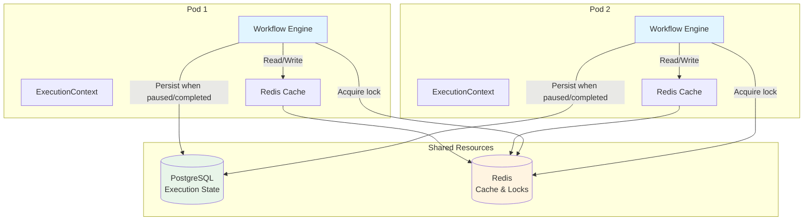
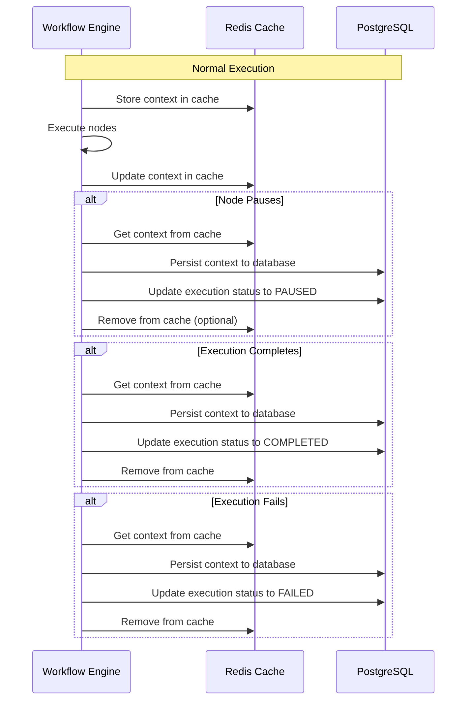
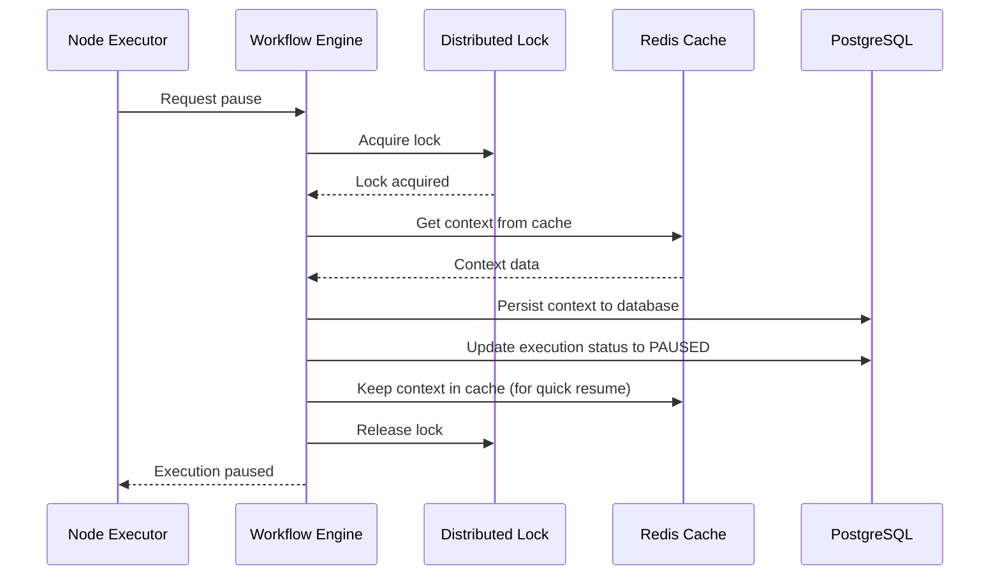
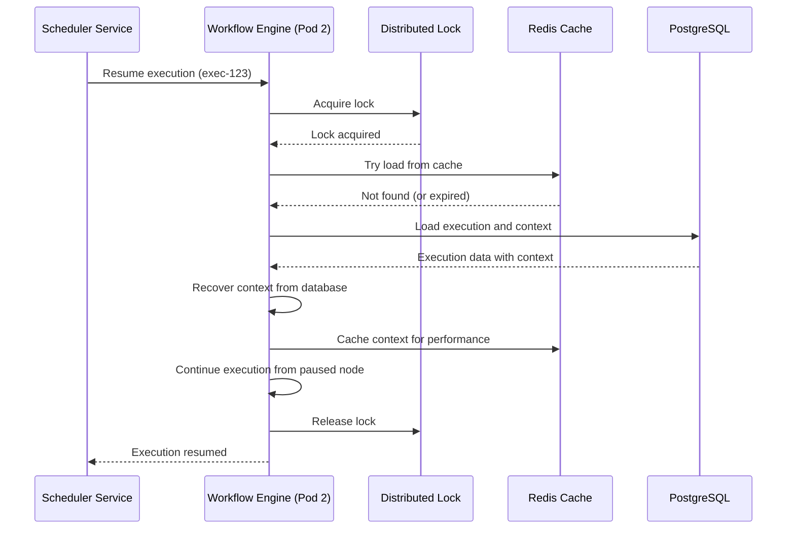

# Distributed Execution Management

## Overview

Distributed execution management enables **pause/resume functionality across multiple pods/instances**. An execution can be paused on one pod and resumed on a different pod without any issues. This is achieved through a combination of database persistence, Redis cache for performance, and distributed locks for data consistency.

## Design Principles

1. **Distributed**: Execution can be paused on one pod and resumed on any pod
2. **Performance**: Use Redis cache to minimize database reads
3. **Data Consistency**: Use distributed locks to prevent race conditions
4. **Efficient Storage**: Only persist context to database when necessary (completed or paused)
5. **Fault Tolerance**: System handles pod failures gracefully

## Architecture



## Context Storage Strategy

### Storage Rules

1. **During Execution**: Context is kept in Redis cache only (not persisted to DB)
2. **On Pause**: Context is persisted to database for recovery
3. **On Completion**: Context is persisted to database for analytics/reporting
4. **On Error**: Context is persisted to database for troubleshooting

### Storage Flow



## Redis Cache Structure

### Execution Context Cache

```redis
# Key pattern: execution:context:{executionId}
# TTL: 24 hours (or until execution completes/pauses)

execution:context:exec-123 = {
  "executionId": "exec-123",
  "workflowId": "workflow-456",
  "triggerId": "trigger-789",
  "triggerNodeId": "trigger-node-abc",
  "currentNodeId": "delay-node-xyz",
  "nodeOutputs": {
    "trigger-node-abc": {...},
    "previous-node": {...}
  },
  "variables": {...},
  "metadata": {...}
}
```

### Node Execution Cache

```redis
# Key pattern: execution:node:{executionId}:{nodeId}
# TTL: 24 hours (or until execution completes/pauses)

execution:node:exec-123:delay-node-xyz = {
  "nodeId": "delay-node-xyz",
  "inputData": {...},
  "outputData": {...},
  "status": "RUNNING"
}
```

### Distributed Lock

```redis
# Key pattern: lock:execution:{executionId}
# TTL: 30 seconds (auto-renewed during execution)
# Value: {instanceId, acquiredAt, expiresAt}

lock:execution:exec-123 = {
  "instanceId": "pod-1",
  "acquiredAt": "2024-01-01T10:00:00Z",
  "expiresAt": "2024-01-01T10:00:30Z"
}
```

## Distributed Lock Implementation

### Lock Acquisition

```java
@Service
public class DistributedLockService {
    
    private final RedisTemplate<String, String> redisTemplate;
    private final String instanceId;
    
    public boolean acquireLock(String executionId, Duration lockDuration) {
        String lockKey = "lock:execution:" + executionId;
        String lockValue = instanceId + ":" + System.currentTimeMillis();
        
        // Try to acquire lock with SET NX EX (set if not exists, with expiration)
        Boolean acquired = redisTemplate.opsForValue()
            .setIfAbsent(lockKey, lockValue, lockDuration);
        
        if (Boolean.TRUE.equals(acquired)) {
            // Start lock renewal thread
            startLockRenewal(executionId, lockDuration);
            return true;
        }
        
        return false;
    }
    
    public boolean releaseLock(String executionId) {
        String lockKey = "lock:execution:" + executionId;
        String currentValue = redisTemplate.opsForValue().get(lockKey);
        
        // Only release if we own the lock
        if (currentValue != null && currentValue.startsWith(instanceId + ":")) {
            redisTemplate.delete(lockKey);
            stopLockRenewal(executionId);
            return true;
        }
        
        return false;
    }
    
    public boolean isLocked(String executionId) {
        String lockKey = "lock:execution:" + executionId;
        return Boolean.TRUE.equals(redisTemplate.hasKey(lockKey));
    }
    
    public boolean isLockedByMe(String executionId) {
        String lockKey = "lock:execution:" + executionId;
        String currentValue = redisTemplate.opsForValue().get(lockKey);
        return currentValue != null && currentValue.startsWith(instanceId + ":");
    }
    
    private void startLockRenewal(String executionId, Duration lockDuration) {
        // Renew lock every lockDuration / 3 to ensure it doesn't expire
        ScheduledExecutorService scheduler = Executors.newScheduledThreadPool(1);
        scheduler.scheduleAtFixedRate(() -> {
            if (isLockedByMe(executionId)) {
                String lockKey = "lock:execution:" + executionId;
                redisTemplate.expire(lockKey, lockDuration);
            } else {
                scheduler.shutdown();
            }
        }, lockDuration.toMillis() / 3, lockDuration.toMillis() / 3, TimeUnit.MILLISECONDS);
    }
}
```

### Lock Usage in Execution

```java
@Service
public class WorkflowExecutor {
    
    private final DistributedLockService lockService;
    private final ExecutionContextCache contextCache;
    private final ExecutionRepository executionRepository;
    
    public void executeNode(String executionId, String nodeId, Map<String, Object> nodeData) {
        // Acquire distributed lock
        if (!lockService.acquireLock(executionId, Duration.ofMinutes(5))) {
            throw new ExecutionLockException("Failed to acquire lock for execution: " + executionId);
        }
        
        try {
            // Load context from cache (or database if not in cache)
            ExecutionContext context = loadContext(executionId);
            
            // Execute node
            NodeExecutionResult result = nodeExecutor.execute(nodeId, nodeData, context);
            
            // Update context in cache
            contextCache.updateContext(executionId, context);
            
            // Check if node pauses execution
            if (result.isWaiting()) {
                // Persist context to database
                persistContext(executionId, context);
                executionRepository.updateStatus(executionId, ExecutionStatus.PAUSED);
                // Keep in cache for quick resume
            }
            
        } finally {
            // Release lock
            lockService.releaseLock(executionId);
        }
    }
}
```

## Execution Context Management

### Context Loading Strategy

```java
@Service
public class ExecutionContextCache {
    
    private final RedisTemplate<String, Object> redisTemplate;
    private final ExecutionRepository executionRepository;
    
    public ExecutionContext loadContext(String executionId) {
        // Try cache first
        ExecutionContext context = loadFromCache(executionId);
        if (context != null) {
            return context;
        }
        
        // Load from database (execution is paused/completed)
        Execution execution = executionRepository.findById(executionId)
            .orElseThrow(() -> new ResourceNotFoundException("Execution not found"));
        
        if (execution.getContext() != null) {
            context = recoverFromDatabase(execution);
            // Optionally cache for quick access
            if (execution.getStatus() == ExecutionStatus.PAUSED) {
                cacheContext(executionId, context);
            }
            return context;
        }
        
        // Create new context
        return new ExecutionContext(executionId, execution.getWorkflowId());
    }
    
    private ExecutionContext loadFromCache(String executionId) {
        String cacheKey = "execution:context:" + executionId;
        Map<String, Object> cached = (Map<String, Object>) redisTemplate.opsForValue().get(cacheKey);
        
        if (cached != null) {
            return deserializeContext(cached);
        }
        
        return null;
    }
    
    public void cacheContext(String executionId, ExecutionContext context) {
        String cacheKey = "execution:context:" + executionId;
        Map<String, Object> serialized = serializeContext(context);
        
        // Cache for 24 hours
        redisTemplate.opsForValue().set(cacheKey, serialized, Duration.ofHours(24));
    }
    
    public void updateContext(String executionId, ExecutionContext context) {
        // Update in cache
        cacheContext(executionId, context);
        
        // Don't persist to DB yet (only on pause/completion)
    }
    
    public void persistContext(String executionId, ExecutionContext context) {
        // Persist to database
        Execution execution = executionRepository.findById(executionId)
            .orElseThrow(() -> new ResourceNotFoundException("Execution not found"));
        
        Map<String, Object> contextData = serializeContext(context);
        execution.setContext(contextData);
        executionRepository.save(execution);
        
        // Optionally keep in cache for quick resume
        if (execution.getStatus() == ExecutionStatus.PAUSED) {
            cacheContext(executionId, context);
        }
    }
    
    public void removeFromCache(String executionId) {
        String cacheKey = "execution:context:" + executionId;
        redisTemplate.delete(cacheKey);
    }
}
```

## Pause/Resume Flow

### Pause Execution



### Resume Execution



### Resume Implementation

```java
@Service
public class ExecutionResumeService {
    
    private final DistributedLockService lockService;
    private final ExecutionContextCache contextCache;
    private final WorkflowExecutor workflowExecutor;
    private final ExecutionRepository executionRepository;
    
    @Scheduled(fixedDelay = 60000) // Check every minute
    public void checkAndResumeExecutions() {
        LocalDateTime now = LocalDateTime.now();
        List<Execution> pausedExecutions = executionRepository
            .findByStatusAndResumeAtBefore(ExecutionStatus.PAUSED, now);
        
        for (Execution execution : pausedExecutions) {
            resumeExecution(execution.getId());
        }
    }
    
    public void resumeExecution(String executionId) {
        // Try to acquire lock (only one pod should resume)
        if (!lockService.acquireLock(executionId, Duration.ofMinutes(5))) {
            log.debug("Failed to acquire lock for execution: {}, another pod may be resuming", executionId);
            return;
        }
        
        try {
            // Check if already resumed (double-check)
            Execution execution = executionRepository.findById(executionId)
                .orElseThrow(() -> new ResourceNotFoundException("Execution not found"));
            
            if (execution.getStatus() != ExecutionStatus.PAUSED) {
                log.debug("Execution {} is not paused, skipping resume", executionId);
                return;
            }
            
            // Update status to RESUMING
            execution.setStatus(ExecutionStatus.RESUMING);
            execution.setResumedAt(LocalDateTime.now());
            execution.setResumedBy(getInstanceId());
            executionRepository.save(execution);
            
            // Load context (from cache or database)
            ExecutionContext context = contextCache.loadContext(executionId);
            
            // Load workflow
            Workflow workflow = workflowRepository.findById(execution.getWorkflowId())
                .orElseThrow(() -> new ResourceNotFoundException("Workflow not found"));
            
            // Resume execution
            workflowExecutor.resumeExecution(workflow, context, execution.getCurrentNodeId());
            
        } catch (Exception e) {
            log.error("Failed to resume execution: {}", executionId, e);
            // Mark execution as failed or keep as paused for retry
        } finally {
            lockService.releaseLock(executionId);
        }
    }
}
```

## Node Pause Implementation

### Delay Node with Distributed Pause

```java
@Component
public class DelayNodeExecutor implements NodeExecutor {
    
    private final ExecutionContextCache contextCache;
    private final ExecutionRepository executionRepository;
    private final SchedulerService schedulerService;
    private final DistributedLockService lockService;
    
    @Override
    public NodeExecutionResult execute(String nodeId, Map<String, Object> nodeData, ExecutionContext context) {
        DelayNodeConfig config = parseConfig(nodeData);
        long delaySeconds = convertToSeconds(config.getDuration(), config.getUnit());
        
        if (delaySeconds > 0) {
            // Acquire lock to ensure atomic pause
            if (!lockService.acquireLock(context.getExecutionId(), Duration.ofSeconds(30))) {
                throw new ExecutionLockException("Failed to acquire lock");
            }
            
            try {
                // Calculate resume time
                LocalDateTime resumeAt = LocalDateTime.now().plusSeconds(delaySeconds);
                
                // Persist context to database (execution is pausing)
                contextCache.persistContext(context.getExecutionId(), context);
                
                // Update execution status
                Execution execution = executionRepository.findById(context.getExecutionId())
                    .orElseThrow(() -> new ResourceNotFoundException("Execution not found"));
                execution.setStatus(ExecutionStatus.PAUSED);
                execution.setResumeAt(resumeAt);
                execution.setCurrentNodeId(nodeId);
                executionRepository.save(execution);
                
                // Schedule resume (any pod can pick this up)
                schedulerService.scheduleResume(context.getExecutionId(), resumeAt);
                
                // Keep context in cache for quick resume
                contextCache.cacheContext(context.getExecutionId(), context);
                
                return NodeExecutionResult.waiting(resumeAt);
                
            } finally {
                lockService.releaseLock(context.getExecutionId());
            }
        }
        
        // No delay, continue immediately
        return NodeExecutionResult.success(null);
    }
}
```

## Execution State Updates

### Update Execution Status

```java
@Service
public class ExecutionStateService {
    
    private final DistributedLockService lockService;
    private final ExecutionContextCache contextCache;
    private final ExecutionRepository executionRepository;
    
    public void updateExecutionStatus(String executionId, ExecutionStatus status) {
        // Acquire lock for state update
        if (!lockService.acquireLock(executionId, Duration.ofSeconds(30))) {
            throw new ExecutionLockException("Failed to acquire lock");
        }
        
        try {
            Execution execution = executionRepository.findById(executionId)
                .orElseThrow(() -> new ResourceNotFoundException("Execution not found"));
            
            execution.setStatus(status);
            
            // Persist context if completing or pausing
            if (status == ExecutionStatus.COMPLETED || status == ExecutionStatus.PAUSED) {
                ExecutionContext context = contextCache.loadContext(executionId);
                contextCache.persistContext(executionId, context);
                
                // Remove from cache if completed
                if (status == ExecutionStatus.COMPLETED) {
                    contextCache.removeFromCache(executionId);
                }
            }
            
            if (status == ExecutionStatus.COMPLETED) {
                execution.setCompletedAt(LocalDateTime.now());
            }
            
            executionRepository.save(execution);
            
        } finally {
            lockService.releaseLock(executionId);
        }
    }
}
```

## Error Handling

### Pod Failure Handling

```java
@Service
public class ExecutionRecoveryService {
    
    private final ExecutionRepository executionRepository;
    private final DistributedLockService lockService;
    
    @Scheduled(fixedDelay = 300000) // Check every 5 minutes
    public void recoverStuckExecutions() {
        // Find executions that are RUNNING but lock has expired
        List<Execution> runningExecutions = executionRepository
            .findByStatus(ExecutionStatus.RUNNING);
        
        for (Execution execution : runningExecutions) {
            // Check if lock exists
            if (!lockService.isLocked(execution.getId())) {
                // Lock expired, execution may be stuck
                log.warn("Execution {} appears to be stuck (no lock), attempting recovery", execution.getId());
                
                // Try to acquire lock and recover
                if (lockService.acquireLock(execution.getId(), Duration.ofMinutes(5))) {
                    try {
                        // Check if execution is actually stuck
                        if (isExecutionStuck(execution)) {
                            // Mark as failed or resume from last known state
                            handleStuckExecution(execution);
                        }
                    } finally {
                        lockService.releaseLock(execution.getId());
                    }
                }
            }
        }
    }
    
    private boolean isExecutionStuck(Execution execution) {
        // Check if execution has been running for too long without updates
        Duration runningDuration = Duration.between(execution.getStartedAt(), LocalDateTime.now());
        return runningDuration.toHours() > 24; // Stuck if running for more than 24 hours
    }
}
```

## Performance Optimization

### Cache Strategy

1. **Hot Data**: Keep active executions in Redis cache
2. **Warm Data**: Keep paused executions in cache for quick resume
3. **Cold Data**: Only in database (completed executions)

### Cache TTL Strategy

```java
// Active execution: 24 hours TTL (auto-renewed during execution)
// Paused execution: 24 hours TTL (for quick resume)
// Completed execution: Remove from cache immediately
// Failed execution: Remove from cache immediately
```

### Database Write Optimization

1. **Batch Writes**: Batch multiple context updates if possible
2. **Async Writes**: Use async writes for non-critical updates
3. **Selective Persistence**: Only persist when necessary

## Benefits

1. **Distributed**: Execution can move between pods seamlessly
2. **Performance**: Redis cache minimizes database reads
3. **Consistency**: Distributed locks prevent race conditions
4. **Efficiency**: Context only persisted when necessary
5. **Fault Tolerance**: Handles pod failures gracefully
6. **Scalability**: Can scale horizontally without issues

## Related Documentation

- [Workflow Execution State](./workflow-execution-state.md) - Execution state management
- [Execution Data Structure](./execution-data-structure.md) - Execution data structure
- [Execution Query Capabilities](./execution-query-capabilities.md) - Query capabilities

