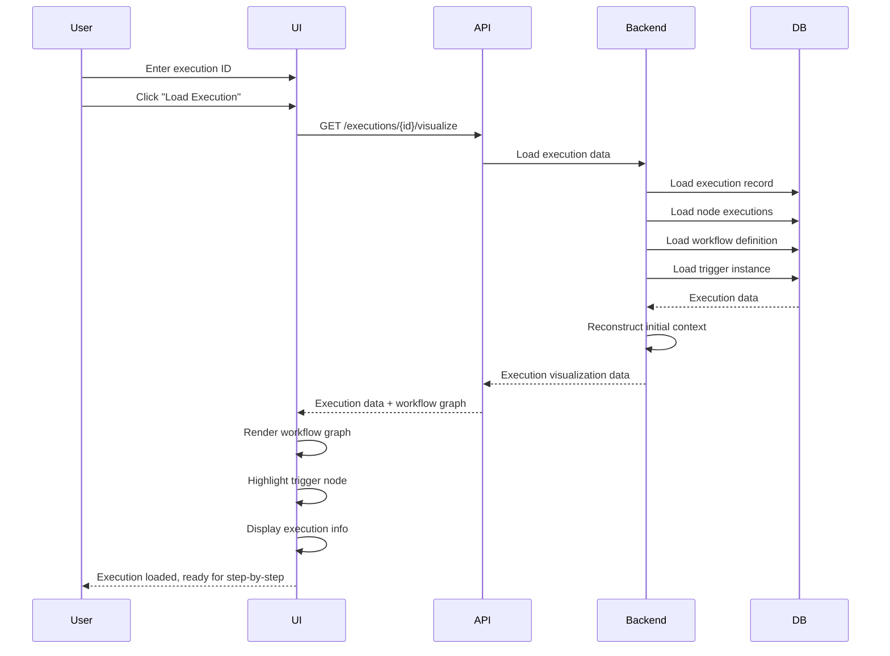
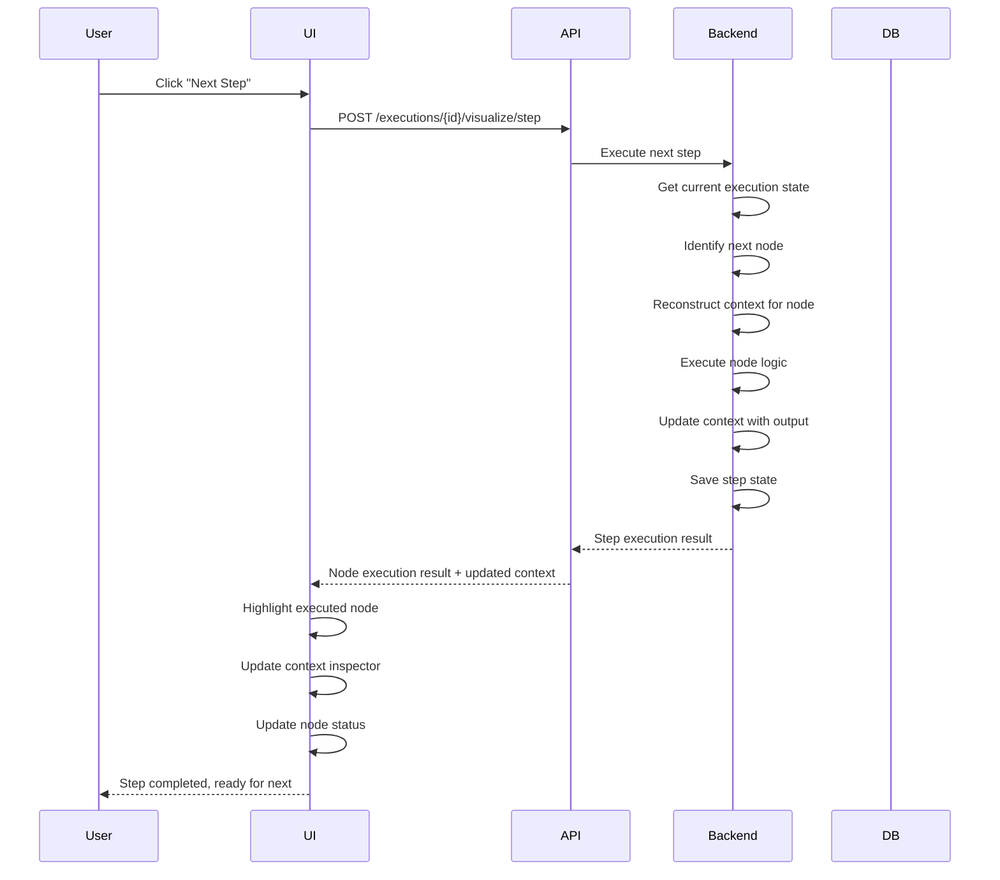

# Execution Visualization Feature

## Overview

The Execution Visualization feature allows users to replay and debug workflow executions step-by-step. Users can input an execution ID, view the complete execution flow, inspect context at each step, and navigate through nodes one by one (similar to a debugger). All execution logic runs on the backend to ensure accuracy.

## Requirements

### User Interface

#### Execution Input
- **Execution ID Input**: Text field for entering execution ID
- **Load Execution**: Button to load execution data
- **Validation**: Validate execution ID exists and is accessible

#### Visualization Canvas
- **Workflow Graph**: Visual representation of the workflow with nodes and connections
- **Current Node Highlight**: Highlight the currently executing node
- **Completed Nodes**: Visual indication of completed nodes
- **Pending Nodes**: Visual indication of pending nodes
- **Failed Nodes**: Visual indication of failed nodes (if any)
- **Node Status Icons**: Icons showing execution status for each node

#### Step-by-Step Controls
- **Play/Pause**: Start/pause step-by-step execution
- **Next Step**: Advance to next node execution
- **Previous Step**: Go back to previous node execution (if supported)
- **Step Counter**: Display current step number and total steps
- **Execution Speed**: Control playback speed (optional)

#### Context Inspector
- **Current Context**: Display execution context at current step
- **Node Input Data**: Show input data for current node
- **Node Output Data**: Show output data for current node
- **Node Configuration**: Show node configuration
- **Context Variables**: Display all context variables and their values
- **Expandable Sections**: Collapsible sections for better organization
- **JSON Viewer**: Pretty-printed JSON for complex data structures

#### Execution Information Panel
- **Execution Details**: Execution ID, workflow ID, status, timestamps
- **Trigger Information**: Trigger type and trigger data
- **Execution Timeline**: Timeline of node executions
- **Error Information**: Error details if execution failed

### Backend Requirements

#### Execution Data Loading
- **Load Execution**: Load complete execution record from database
- **Load Node Executions**: Load all node execution records for the execution
- **Load Workflow Definition**: Load workflow definition for context
- **Load Trigger Instance**: Load trigger instance information
- **Reconstruct Context**: Reconstruct execution context from stored data

#### Step-by-Step Execution Engine
- **Execution Replay**: Replay execution logic step-by-step
- **Context Reconstruction**: Reconstruct context at each step
- **Node Execution Logic**: Execute node logic using original configuration
- **Data Flow Tracking**: Track data flow between nodes
- **State Management**: Manage execution state for step-by-step navigation

#### API Endpoints
- **GET /executions/{id}/visualize**: Get execution data for visualization
- **POST /executions/{id}/visualize/step**: Execute next step
- **GET /executions/{id}/visualize/step/{stepNumber}**: Get execution state at specific step
- **POST /executions/{id}/visualize/reset**: Reset visualization to start
- **GET /executions/{id}/visualize/context**: Get current context

## User Flow

### 1. Load Execution



### 2. Step-by-Step Execution



## Data Structure

### Execution Visualization Response

```json
{
  "execution": {
    "id": "exec-123",
    "workflow_id": "workflow-456",
    "status": "COMPLETED",
    "started_at": "2024-01-01T00:00:00Z",
    "completed_at": "2024-01-01T00:05:00Z"
  },
  "workflow": {
    "id": "workflow-456",
    "name": "User Onboarding Workflow",
    "definition": {
      "nodes": [...],
      "edges": [...]
    }
  },
  "trigger": {
    "type": "api",
    "data": {...}
  },
  "current_step": 0,
  "total_steps": 5,
  "nodes": [
    {
      "id": "node-1",
      "type": "trigger",
      "status": "completed",
      "execution": {
        "id": "node-exec-1",
        "input_data": {...},
        "output_data": {...},
        "started_at": "2024-01-01T00:00:00Z",
        "completed_at": "2024-01-01T00:00:01Z"
      }
    },
    {
      "id": "node-2",
      "type": "logic",
      "status": "pending",
      "execution": null
    }
  ],
  "context": {
    "executionId": "exec-123",
    "workflowId": "workflow-456",
    "nodeOutputs": {
      "node-1": {...}
    },
    "variables": {...}
  }
}
```

### Step Execution Request

```json
{
  "step_number": 2,
  "direction": "forward"  // or "backward" for previous step
}
```

### Step Execution Response

```json
{
  "step_number": 2,
  "node_id": "node-2",
  "node_type": "action",
  "status": "completed",
  "execution": {
    "id": "node-exec-2",
    "input_data": {...},
    "output_data": {...},
    "started_at": "2024-01-01T00:00:02Z",
    "completed_at": "2024-01-01T00:00:03Z"
  },
  "context": {
    "executionId": "exec-123",
    "workflowId": "workflow-456",
    "nodeOutputs": {
      "node-1": {...},
      "node-2": {...}
    },
    "variables": {...}
  },
  "next_node": "node-3",
  "has_next": true,
  "has_previous": true
}
```

## Technical Requirements

### Frontend
- **React Component**: Execution visualization component
- **Workflow Graph**: Reuse workflow builder graph component
- **State Management**: Manage step-by-step execution state
- **Context Viewer**: JSON viewer component for context inspection
- **Real-time Updates**: Update UI on each step execution

### Backend
- **Execution Service**: Service for loading execution data
- **Visualization Service**: Service for step-by-step execution
- **Context Reconstruction**: Logic to reconstruct context at each step
- **Node Execution Engine**: Reuse node execution logic from workflow engine
- **State Persistence**: Persist step state for navigation

### Performance Considerations
- **Lazy Loading**: Load node execution data on demand
- **Caching**: Cache execution data during visualization session
- **Optimization**: Optimize context reconstruction for large executions
- **Pagination**: Paginate node executions for large workflows

## Use Cases

### 1. Debug Failed Execution
- User loads failed execution
- Step through execution to identify failure point
- Inspect context at failure point
- Understand why execution failed

### 2. Understand Execution Flow
- User loads successful execution
- Step through execution to understand flow
- Inspect data transformations at each step
- Learn how workflow processes data

### 3. Test Workflow Logic
- User loads test execution
- Step through execution to verify logic
- Inspect context to verify data transformations
- Validate workflow behavior

### 4. Troubleshoot Performance
- User loads slow execution
- Step through execution to identify bottlenecks
- Inspect execution times at each step
- Optimize workflow based on findings

## Related Documentation

- [Workflow Builder](./workflow-builder.md) - Workflow creation and editing
- [Workflow Execution State](./workflow-execution-state.md) - Execution state management
- [Execution Data Structure](./execution-data-structure.md) - Execution data format
- [API Endpoints](../api/endpoints.md#execution-visualization) - API specifications

