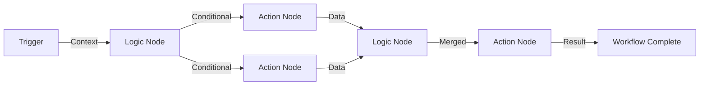

# Workflow Node Types Specification

## Overview

This document provides detailed specifications for all node types in the workflow builder. The platform supports **3 main node categories**: Trigger, Logic, and Action.

## Node Category Structure

```
Node Categories
├── Trigger (Entry points)
│   ├── API Call
│   ├── Scheduler
│   └── Event (Kafka)
├── Logic (Control flow)
│   ├── Condition
│   ├── Switch
│   ├── Loop
│   ├── Delay
│   ├── Wait for Events
│   └── Merge
└── Action (Operations)
    ├── API Call
    ├── Publish Event (Kafka)
    ├── Function
    └── Custom Action
```

## Trigger Nodes

Trigger nodes are entry points that start workflow execution. Each workflow must have exactly one trigger node.

**Registry-Based Selection**: Triggers must be selected from the Trigger Registry. Each trigger instance in a workflow creates an independent consumer/scheduler that can be managed separately.

### API Call Trigger

**Type**: `trigger` → `api-call`

**Registry ID**: `api-trigger-standard` (example)

**Description**: Receives HTTP request to start workflow execution.

**Configuration**:
- **Registry ID**: Reference to trigger definition in registry
- **Endpoint Path**: Unique path for the trigger (e.g., `/api/v1/trigger/workflow-123`)
- **HTTP Method**: GET, POST, PUT, PATCH (typically POST)
- **Authentication**: Optional API key or token authentication
- **Request Validation**: JSON schema validation for request body

**Input**: HTTP request
**Output**: Request data passed to workflow context

**Instance Management**: Each API trigger instance has its own endpoint and can be paused/resumed/stopped independently.

**See**: [API Trigger Details](./triggers.md#1-api-call-trigger) and [Trigger Registry](./trigger-registry.md)

### Scheduler Trigger

**Type**: `trigger` → `scheduler`

**Registry ID**: `scheduler-trigger-standard` (example)

**Description**: Cron-based scheduled execution.

**Configuration**:
- **Registry ID**: Reference to trigger definition in registry
- **Cron Expression**: Standard cron format (e.g., `0 9 * * *` for daily at 9 AM)
- **Timezone**: Timezone for schedule
- **Start Date**: When schedule becomes active
- **End Date**: When schedule expires (optional)
- **Repeat**: One-time or recurring

**Input**: Schedule timer
**Output**: Static or dynamic data passed to workflow context

**Instance Management**: Each scheduler trigger instance has its own scheduler and can be paused/resumed/stopped independently.

**See**: [Scheduled Trigger Details](./triggers.md#2-scheduled-trigger) and [Trigger Registry](./trigger-registry.md)

### Event Trigger (Kafka)

**Type**: `trigger` → `event`

**Registry ID**: `kafka-event-trigger-standard` (example)

**Description**: Listens to Kafka topic events and triggers workflow.

**Configuration**:
- **Registry ID**: Reference to trigger definition in registry
- **Kafka Brokers**: Kafka broker addresses
- **Topic**: Kafka topic name to subscribe to
- **Consumer Group**: Consumer group ID (unique per workflow instance)
- **Offset**: Start from beginning or latest
- **Message Format**: JSON message format
- **Filter**: Optional message filtering
- **Schemas**: Multiple schemas for different event types in the topic

**Input**: Kafka message
**Output**: Message data passed to workflow context

**Instance Management**: Each Kafka event trigger instance has its own consumer with unique consumer group and can be paused/resumed/stopped independently.

**See**: [Event Trigger Details](./triggers.md#3-event-trigger-kafka) and [Trigger Registry](./trigger-registry.md)

## Logic Nodes

Logic nodes control workflow execution flow and conditional branching.

### Condition

**Type**: `logic` → `condition`

**Description**: If/Then/Else branching based on conditions.

**Configuration**:
- **Conditions**: 
  - Field comparison (equals, not equals, greater than, less than, contains, etc.)
  - Multiple conditions with AND/OR logic
- **Input Field**: Field from previous node or context to evaluate

**Input**: Data from previous node
**Output**: 
- **True Branch**: Output when condition is true
- **False Branch**: Output when condition is false

**Example**:
```json
{
  "condition": "user.status == 'active'",
  "trueBranch": "Send Welcome Email",
  "falseBranch": "Send Activation Email"
}
```

### Switch

**Type**: `logic` → `switch`

**Description**: Multi-case branching with default fallback.

**Configuration**:
- **Switch Field**: Field from previous node or context to evaluate
- **Cases**: Array of case conditions with corresponding branches
- **Default Case**: Fallback branch when no case matches

**Input**: Data from previous node
**Output**: One branch per case + default branch

**Example**:
```json
{
  "switchField": "user.plan",
  "cases": [
    { "value": "basic", "branch": "Basic Plan Flow" },
    { "value": "premium", "branch": "Premium Plan Flow" },
    { "value": "enterprise", "branch": "Enterprise Plan Flow" }
  ],
  "defaultBranch": "Default Flow"
}
```

### Loop

**Type**: `logic` → `loop`

**Description**: Iterate over array and process each item.

**Configuration**:
- **Array Field**: Field containing array to iterate over
- **Item Variable**: Variable name for current item in loop
- **Index Variable**: Variable name for current index (optional)

**Input**: Data from previous node containing array
**Output**: Accumulated results from all iterations

**Example**:
```json
{
  "arrayField": "users",
  "itemVariable": "user",
  "indexVariable": "index"
}
```

### Delay

**Type**: `logic` → `delay`

**Description**: Wait for specified time duration before continuing. Supports scalable pause/resume with persistent state.

**Configuration**:
- **Duration**: Time to wait (seconds, minutes, hours)
- **Unit**: Time unit (seconds, minutes, hours)
- **PersistState**: Whether to persist execution state (default: true for delays > 1 hour)
- **Retry**: Optional retry configuration (see Retry Configuration below)

**Input**: Data from previous node
**Output**: Same data after delay

**Persistent State**:
- Execution state is persisted to database when delay is active
- Full context snapshot is saved including trigger, execution, and workflow information
- Execution can be resumed on any instance after delay completes
- Supports long delays (e.g., 10 hours) with scalable architecture

**Example**:
```json
{
  "duration": 36000,
  "unit": "seconds",
  "persistState": true,
  "retry": {
    "enabled": false
  }
}
```

**See**: [Workflow Execution State](./workflow-execution-state.md) for details on state persistence and resume.

### Wait for Events

**Type**: `logic` → `wait-events`

**Description**: Wait for multiple async events and aggregate results.

**Configuration**:
- **Events**: Array of events to wait for
  - **Type**: Event type (API response, Kafka event, etc.)
  - **Timeout**: Maximum wait time for each event
  - **Required**: Whether event is required or optional

**Input**: Data from previous node
**Output**: Aggregated data from all events

**Implementation**: This is implemented as a Custom Action in the backend. See [Async Event Aggregation](../technical/integration/async-event-aggregation.md) for details.

**Example**:
```json
{
  "events": [
    {
      "type": "api-response",
      "endpoint": "https://api.example.com/users",
      "timeout": 5000,
      "required": true
    },
    {
      "type": "kafka-event",
      "topic": "user-events",
      "timeout": 10000,
      "required": false
    }
  ]
}
```

### Merge

**Type**: `logic` → `merge`

**Description**: Combine multiple branches into single flow.

**Configuration**:
- **Merge Strategy**: How to combine data from multiple branches
  - **All**: Include all data from all branches
  - **First**: Use data from first branch
  - **Last**: Use data from last branch
  - **Custom**: Custom merge logic

**Input**: Multiple branches (2 or more)
**Output**: Merged data from all input branches

**Example**:
```json
{
  "mergeStrategy": "all",
  "branches": ["branch1", "branch2", "branch3"]
}
```

## Action Nodes

Action nodes perform operations, side effects, and external interactions.

**Registry-Based Selection**: Actions must be selected from the Action Registry. Each action instance uses the configuration from the registry definition.

### API Call Action

**Type**: `action` → `api-call`

**Registry ID**: `api-call-action-standard` (example)

**Description**: Make HTTP request to external API.

**Configuration**:
- **Registry ID**: Reference to action definition in registry
- **URL**: API endpoint URL
- **Method**: HTTP method (GET, POST, PUT, PATCH, DELETE)
- **Headers**: HTTP headers (key-value pairs)
- **Body**: Request body (JSON, form data, etc.)
- **Authentication**: Optional authentication (API key, Bearer token, etc.)
- **Timeout**: Request timeout in milliseconds
- **Retry**: Retry configuration (max attempts, backoff strategy)

**Input**: Data from previous node
**Output**: API response data

**See**: [Action Registry](./action-registry.md)

**Example**:
```json
{
  "url": "https://api.example.com/users",
  "method": "POST",
  "headers": {
    "Content-Type": "application/json",
    "Authorization": "Bearer ${token}"
  },
  "body": {
    "name": "${user.name}",
    "email": "${user.email}"
  },
  "timeout": 5000,
  "retry": {
    "maxAttempts": 3,
    "backoffStrategy": "exponential"
  }
}
```

### Publish Event Action (Kafka)

**Type**: `action` → `publish-event`

**Registry ID**: `publish-event-action-kafka` (example)

**Description**: Publish message to Kafka topic.

**Configuration**:
- **Kafka Brokers**: Kafka broker addresses
- **Topic**: Kafka topic name
- **Key**: Message key (optional, for partitioning)
- **Message**: Message payload (JSON object)
- **Headers**: Optional message headers
- **Partition**: Target partition (optional)

**Input**: Data from previous node
**Output**: Publication status (success/failure, offset, partition)

**Example**:
```json
{
  "brokers": ["localhost:9092"],
  "topic": "user-events",
  "key": "${user.id}",
  "message": {
    "eventType": "user.created",
    "userId": "${user.id}",
    "timestamp": "${_metadata.timestamp}"
  },
  "headers": {
    "source": "workflow-engine"
  }
}
```

### Function Action

**Type**: `action` → `function`

**Registry ID**: `function-action-standard` (example)

**Description**: Define simple calculation logic on UI using visual expression builder.

**Configuration**:
- **Expression**: Visual expression builder for data transformations
- **Supported Operations**:
  - **Arithmetic**: +, -, *, /, %, pow
  - **String**: concat, substring, replace, uppercase, lowercase, trim
  - **Date**: format, parse, addDays, addHours, diff
  - **Array**: length, map, filter, reduce, join
  - **Object**: get, set, merge, keys, values
  - **Logic**: ==, !=, >, <, >=, <=, &&, ||, !
  - **Type Conversion**: toString, toNumber, toBoolean, toDate

**Input**: Data from previous node
**Output**: Calculated result

**Context Access**:
- Previous node outputs: `_nodeOutputs.{nodeLabel}.{field}`
- Workflow variables: `${variableName}`
- Trigger data: `${triggerData.field}`
- Metadata: `${_metadata.field}`

**Example**:
```json
{
  "expression": "concat(user.firstName, ' ', user.lastName)",
  "outputField": "fullName"
}
```

**Visual Expression Builder**:
- Drag-and-drop field selectors
- Operator buttons (+, -, *, /, etc.)
- Function selector (concat, format, etc.)
- Preview of expression result
- Validation and error highlighting

**Limitations**:
- Simple calculations only (no complex loops or recursion)
- No external API calls
- No file I/O operations
- No database queries
- For complex logic, use Custom Action instead

### Custom Action

**Type**: `action` → `custom-action`

**Registry ID**: Varies by action type (e.g., `send-email-action`, `send-sms-action`)

**Description**: Map to complex backend implementation that cannot be represented on UI.

**Purpose**:
- Implement complex operations that require backend logic
- Handle operations that cannot be expressed in Function node
- Support pre-registered action types (e.g., notification channels)

**Configuration**:
- **Action Type**: Pre-registered custom action type
- **Type-Specific Configuration**: Configuration varies by action type

**Input**: Data from previous node
**Output**: Custom action result (varies by action type)

**Pre-Registered Custom Action Types**:

1. **Send Email** (`send-email`)
   - Recipients configuration
   - Subject and body
   - Attachment support

2. **Send SMS** (`send-sms`)
   - Recipients configuration
   - Message content

3. **Send Push Notification** (`send-push`)
   - Push payload configuration
   - Target devices
   - Platform-specific settings (iOS, Android)

4. **Send In-App Notification** (`send-in-app`)
   - In-app message configuration
   - Target users

5. **Send Slack Message** (`send-slack`)
   - Slack channel configuration
   - Message format (blocks, text)

6. **Send Discord Message** (`send-discord`)
   - Discord channel configuration
   - Message format

7. **Send Teams Message** (`send-teams`)
   - Teams channel configuration
   - Message format (adaptive cards)

8. **Send Webhook** (`send-webhook`)
   - Webhook URL configuration
   - Payload format
   - Authentication

9. **Wait for Events** (`wait-events`)
   - Complex async event aggregation
   - Multiple event sources (API, Kafka, etc.)
   - Timeout and error handling
   - See [Async Event Aggregation](../technical/integration/async-event-aggregation.md) for details

**Example - Send Email Custom Action**:
```json
{
  "actionType": "send-email",
  "config": {
    "recipients": ["${user.email}"],
    "subject": "Welcome to our platform!",
    "body": "Hello ${user.name}, welcome to our platform!",
    "attachments": []
  }
}
```

**Custom Action Registration**:
- Custom actions are registered in the backend
- Each custom action has a unique type identifier
- Configuration schema is defined per action type
- Frontend displays appropriate UI based on action type

## Node Retry Configuration

All nodes support optional retry configuration using Resilience4j.

### Retry Configuration

```json
{
  "retry": {
    "enabled": true,
    "maxAttempts": 3,
    "waitDuration": 1000,
    "exponentialBackoff": true,
    "multiplier": 2.0,
    "retryOn": ["IOException", "TimeoutException", "5xx"],
    "ignoreExceptions": ["IllegalArgumentException"]
  }
}
```

### Retry Options

- **enabled**: Enable/disable retry (default: false)
- **maxAttempts**: Maximum number of retry attempts (default: 3)
- **waitDuration**: Initial wait duration in milliseconds (default: 1000)
- **exponentialBackoff**: Use exponential backoff (default: true)
- **multiplier**: Backoff multiplier for exponential backoff (default: 2.0)
- **retryOn**: List of exceptions/status codes to retry on
- **ignoreExceptions**: List of exceptions to not retry on

### Retry Examples

**API Call Action with Retry**:
```json
{
  "nodeId": "api-call-1",
  "type": "action",
  "subType": "api-call",
  "config": {
    "url": "https://api.example.com/users",
    "method": "POST",
    "retry": {
      "enabled": true,
      "maxAttempts": 3,
      "waitDuration": 1000,
      "exponentialBackoff": true,
      "retryOn": ["5xx", "408", "429"],
      "ignoreExceptions": ["4xx"]
    }
  }
}
```

**Function Action with Retry**:
```json
{
  "nodeId": "function-1",
  "type": "action",
  "subType": "function",
  "config": {
    "expression": "user.age >= 18 ? 'adult' : 'minor'",
    "retry": {
      "enabled": true,
      "maxAttempts": 2,
      "waitDuration": 500,
      "exponentialBackoff": false
    }
  }
}
```

**See**: [Workflow Execution State](./workflow-execution-state.md) for retry implementation details.

## Node Execution Flow

### Execution Order

1. **Trigger Node**: Executes first, creates workflow context
2. **Logic Nodes**: Control flow based on conditions and data
3. **Action Nodes**: Perform operations and side effects
4. **Output**: Final result passed to workflow completion handler

### Execution State Management

- **Persistent State**: Execution state is persisted for pause/resume support
- **Context Recovery**: Full context recovery including trigger, execution, and workflow information
- **Scalable Resume**: Execution can be resumed on any instance
- **Node-Level Pause**: Individual nodes can pause execution (e.g., delay node)

### Data Flow



### Error Handling

- **Node-level errors**: Each node can handle errors independently
- **Workflow-level errors**: Global error handler for unhandled errors
- **Retry logic**: Configurable retries for failed nodes
- **Error notifications**: Alert on workflow failures

## Related Documentation

- [Workflow Execution State](./workflow-execution-state.md) - Execution state management and context recovery
- [Trigger Registry](./trigger-registry.md) - Registry system for trigger definitions
- [Action Registry](./action-registry.md) - Registry system for action definitions
- [Workflow Builder](./workflow-builder.md) - Main workflow builder feature
- [Triggers](./triggers.md) - Trigger node details
- [Async Event Aggregation](../technical/integration/async-event-aggregation.md) - Wait for Events implementation

