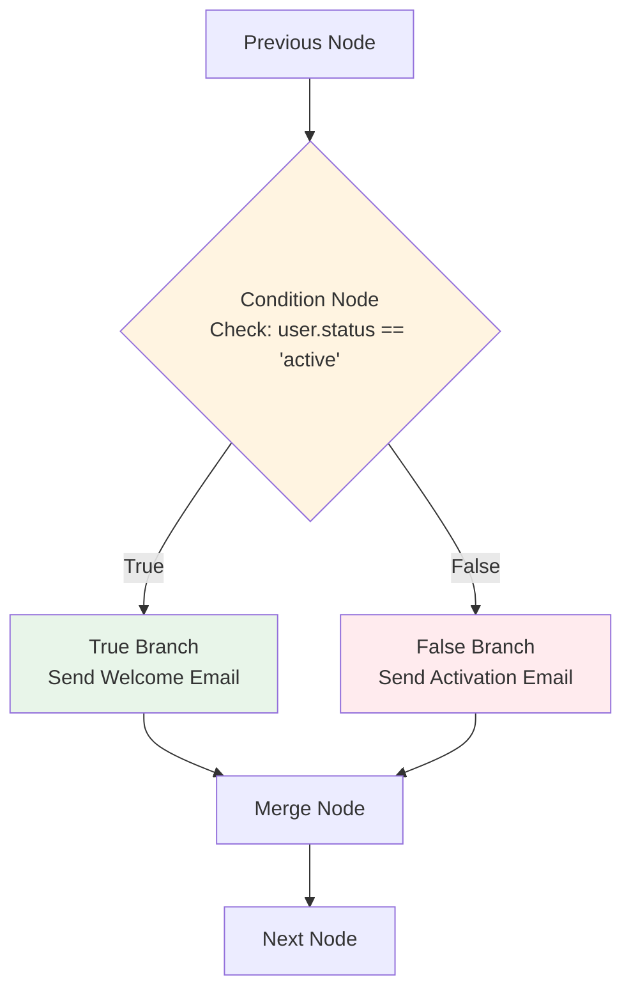
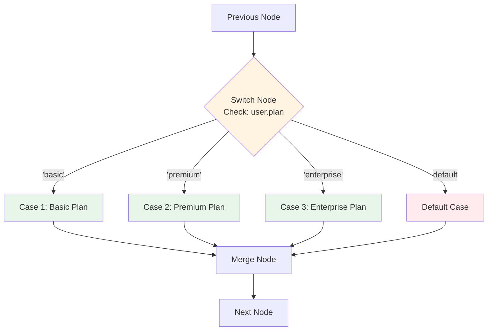
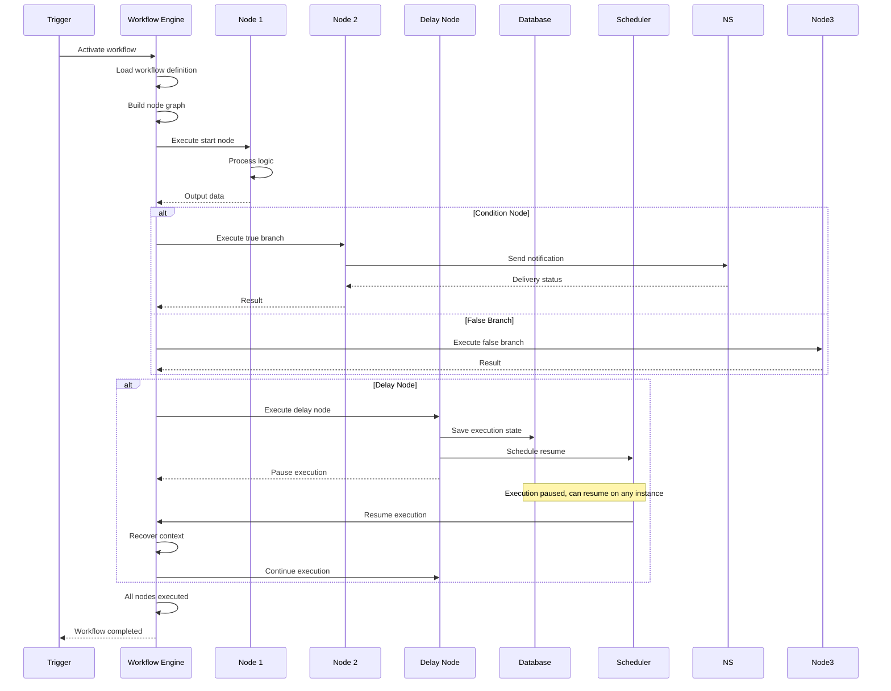
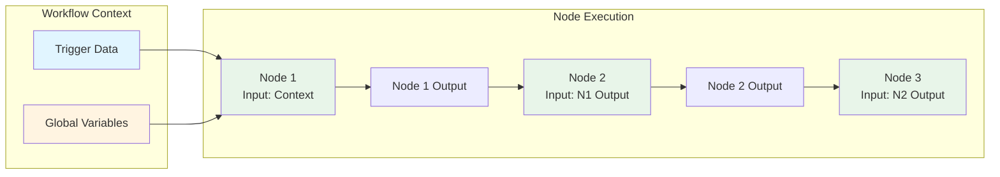

# Workflow Builder Feature

## Overview

The Workflow Builder is the core feature that allows users (Developers and Marketing teams) to create notification workflows using a visual drag-and-drop interface without writing code.

## Requirements

### User Interface

#### Drag-and-Drop Interface
- **Visual Canvas**: Large, scrollable canvas area for building workflows
- **Node Palette**: Sidebar with draggable nodes/components organized into 3 categories:
  - **Trigger nodes**: Entry points that start workflow execution (selected from Trigger Registry)
  - **Logic nodes**: Control flow and conditional logic
  - **Action nodes**: Perform operations and side effects (selected from Action Registry)
- **Connection System**: Visual connections between nodes using lines/arrows
- **Node Properties Panel**: Right sidebar showing editable properties for selected node
- **Canvas Controls**: Zoom, pan, grid toggle, minimap

#### Registry-Based Selection
- **Trigger Selection**: Users select triggers from the Trigger Registry when adding trigger nodes
- **Action Selection**: Users select actions from the Action Registry when adding action nodes
- **Registry Display**: Node palette shows available triggers and actions from registry with name, description, and icon
- **Instance Configuration**: Each trigger/action instance in workflow has its own configuration
- See [Trigger Registry](./trigger-registry.md) and [Action Registry](./action-registry.md) for details

#### Node Types

The workflow builder supports **3 main node categories**, each with specific subtypes:

##### 1. Trigger Nodes

Trigger nodes are entry points that start workflow execution. A workflow can have one or more trigger nodes.

**Trigger-First Flow**:
1. **Create Trigger Config First**: User goes to Trigger Management page and creates a trigger config
2. **Add Trigger Node to Workflow**: User drags "Trigger" node from palette to canvas
3. **Select Trigger Config**: Properties Panel shows list of available trigger configs from Trigger Registry
4. **Link Trigger Config**: User selects a trigger config (e.g., "Daily 9 AM Report", "User Registration API")
5. **Configure Instance Settings**: User configures instance-specific settings (e.g., consumerGroup for Event triggers)
6. **Trigger Instance Created**: System creates trigger instance in workflow definition node data

**Available Trigger Types**:
- **API Call Trigger** (`api-call`): Receives HTTP request to start workflow
- **Scheduler Trigger** (`scheduler`): Cron-based scheduled execution
- **Event Trigger** (`event`): Listens to Kafka topic events

**Trigger Instance Structure**:
```json
{
  "id": "node-1",
  "nodeType": "trigger",
  "nodeConfig": {
    "triggerConfigId": "trigger-config-123",
    "triggerType": "event",
    "instanceConfig": {
      "consumerGroup": "workflow-456-consumer"
    }
  }
}
```

**Trigger Instance Lifecycle**:
- **Created**: When trigger config is linked to workflow node
- **Activated**: When workflow is activated (starts consumer/scheduler)
- **Paused**: When workflow is paused (stops processing but keeps connection)
- **Resumed**: When workflow is resumed
- **Stopped**: When workflow is deactivated (stops completely)

**Note**: Runtime state (ACTIVE, PAUSED, STOPPED) is stored in workflow definition.

See [Trigger Registry](./trigger-registry.md) for registry details and [Triggers](./triggers.md) for trigger configuration.

##### 2. Logic Nodes

Logic nodes control workflow execution flow and conditional branching.

**Condition:**
- If/Then/Else branching based on conditions
- Field comparison (equals, not equals, greater than, less than, contains, etc.)
- Multiple conditions with AND/OR logic
- Two output branches: True and False

**Switch:**
- Multi-case branching
- Multiple case conditions with default fallback
- One output branch per case plus default

**Loop:**
- Iterate over array
- Process each item in sequence
- Single output with accumulated results

**Delay:**
- Wait for specified time duration
- Configurable delay (seconds, minutes, hours)
- Single output after delay

**Wait for Events:**
- Wait for multiple async events (API response + Kafka event)
- Aggregates results from multiple async operations
- See [Async Event Aggregation](../technical/integration/async-event-aggregation.md) for detailed implementation
- Single output with aggregated data

**Merge:**
- Combine multiple branches into single flow
- Merges outputs from multiple input branches
- Single output with merged data

##### 3. Action Nodes

Action nodes perform operations, side effects, and external interactions.

**Action-First Flow** (Similar to Trigger):
1. **Create Action Definition First**: User goes to Action Management page and creates an action definition (if not exists in registry)
2. **Add Action Node to Workflow**: User drags "Action" node from palette to canvas
3. **Select Action from Registry**: Properties Panel shows list of available actions from Action Registry
4. **Link Action Definition**: User selects an action definition (e.g., "API Call Action", "Send Email")
5. **Configure Action Settings**: User configures action-specific settings (URL, topic, template, etc.)
6. **Action Config Stored**: Configuration is stored in workflow definition node data

**Note**: Unlike triggers, actions do not have a separate config table. Action definitions are in the registry (`actions` table), and action configuration is stored directly in workflow definition node data.

**Available Action Types** (from Registry):
- **API Call Action**: Make HTTP request to external API
- **Publish Event Action (Kafka)**: Publish message to Kafka topic
- **Function Action**: Define simple calculation logic on UI
- **Custom Actions**: Pre-registered complex actions
  - Send Email
  - Send SMS
  - Send Push Notification
  - Send In-App Notification
  - Send Slack Message
  - Send Discord Message
  - Send Teams Message
  - Send Webhook
  - Wait for Events

See [Action Registry](./action-registry.md) for registry details and [Node Types](./node-types.md) for action specifications.

#### Workflow Properties
- **Name**: Workflow identifier
- **Description**: User-provided description
- **Status**: Active/Inactive/Paused
- **Version**: Version control for workflows
- **Tags**: Categorization tags
- **Created/Updated**: Timestamps

### Conditional Logic

#### Condition Node



- **Input**: Data from previous node
- **Conditions**: 
  - Field comparison (equals, not equals, greater than, less than, contains, etc.)
  - Multiple conditions with AND/OR logic
- **Output Branches**: True branch, False branch
- **Visual**: Clear branching in canvas

#### Switch Node



- **Input**: Data from previous node
- **Cases**: Multiple case conditions
- **Default Case**: Fallback branch
- **Output**: One branch per case + default

### Workflow Execution

#### Execution Flow



1. Trigger activates workflow
2. Workflow engine processes nodes sequentially
3. Each node receives input from previous node
4. Node executes and produces output
5. **If node pauses (e.g., delay)**: Execution state is persisted, can be resumed on any instance
6. **On resume**: Full context is recovered including trigger, execution, and workflow information
7. Output flows to connected nodes
8. Workflow completes or errors

#### Error Handling
- **Node-level errors**: Catch and handle per node
- **Workflow-level errors**: Global error handler
- **Retry logic**: Optional retry configuration for each node using Resilience4j
  - Configurable max attempts, wait duration, exponential backoff
  - Retry on specific exceptions/status codes
  - Ignore specific exceptions
- **Error notifications**: Alert on workflow failures

#### Execution State Management
- **Persistent State**: Execution state is persisted to database for scalability
- **Pause/Resume**: Nodes can pause execution (e.g., delay node)
- **Context Recovery**: Full context recovery including trigger, execution, and workflow information
- **Scalable Resume**: Execution can be resumed on any instance after pause
- **Long-Running Operations**: Support for delays and async operations (e.g., 10 hours delay)

See [Workflow Execution State](./workflow-execution-state.md) for detailed implementation.

#### Data Flow



- **Context**: Workflow execution context (trigger data, variables)
- **Node Input**: Data from previous node or context
- **Node Output**: Transformed data passed to next node
- **Variables**: Global workflow variables accessible by all nodes

### Preview and Testing

#### Preview Mode
- **Visual Preview**: See workflow structure without executing
- **Data Preview**: Test with sample data
- **Step-by-step Execution**: Execute one node at a time
- **Debug Mode**: View data at each node

#### Testing
- **Test Execution**: Run workflow with test data
- **Test Results**: View execution results
- **Validation**: Validate workflow before activation
- **Dry Run**: Execute without sending actual actions

#### Execution Visualization
- **Replay Execution**: Load and replay any execution by execution ID
- **Step-by-Step Debug**: Navigate through execution steps one by one
- **Context Inspection**: View execution context at each step
- **Node Execution Details**: Inspect input/output data for each node
- See [Execution Visualization](./execution-visualization.md) for detailed specifications

### Workflow Management

#### CRUD Operations
- **Create**: New workflow from scratch
- **Read**: View workflow details and structure
- **Update**: Edit workflow (creates new version)
- **Delete**: Soft delete workflow

#### Version Control
- **Version History**: Track all workflow versions
- **Version Comparison**: Compare different versions
- **Rollback**: Revert to previous version
- **Version Tags**: Mark versions as production, staging, etc.

#### Workflow Status
- **Draft**: Workflow being created/edited
- **Active**: Workflow is live and executing
- **Inactive**: Workflow is disabled
- **Paused**: Temporarily paused
- **Archived**: No longer in use

## User Experience

### For Non-Technical Users (Marketing Teams)
- **Intuitive Interface**: Clear visual representation
- **Guided Creation**: Step-by-step wizard option
- **Help Tooltips**: Contextual help for each node
- **Validation Messages**: Clear error messages

### For Technical Users (Developers)
- **Advanced Options**: Access to raw data, custom logic
- **API Integration**: Trigger workflows via API
- **Custom Nodes**: Extend with custom node types (future)
- **Export/Import**: JSON export for version control
- **Bulk Operations**: Manage multiple workflows

## Technical Requirements

### Frontend
- **Framework**: React with drag-and-drop library (react-flow, react-dnd, or similar)
- **State Management**: Manage workflow state, node positions, connections
- **Validation**: Client-side validation before saving
- **Auto-save**: Periodic auto-save of workflow

### Backend
- **Workflow Engine**: Execute workflows based on definition
- **Node Execution**: Process each node type
- **Data Transformation**: Handle data flow between nodes
- **Persistence**: Store workflow definitions in database

### Integration
- **API**: REST API for CRUD operations
- **WebSocket** (optional for MVP): Real-time updates (not required for MVP)
- **File Storage**: Store workflow definitions, versions

## Data Model

See [Database Schema - Workflows](../database-schema/entities.md#workflows)

## API Endpoints

See [API - Workflows](../api/endpoints.md#workflows)

## User Flows

See [User Flows - Workflow Creation](../user-flows/workflow-creation.md)

## Related Features

- [Workflow Execution State](./workflow-execution-state.md) - Execution state management and context recovery
- [Trigger Registry](./trigger-registry.md) - Registry system for trigger definitions
- [Action Registry](./action-registry.md) - Registry system for action definitions
- [Node Types](./node-types.md) - Detailed specifications for all node types
- [Triggers](./triggers.md) - Workflow trigger mechanisms
- [Analytics](./analytics.md) - Workflow execution analytics


