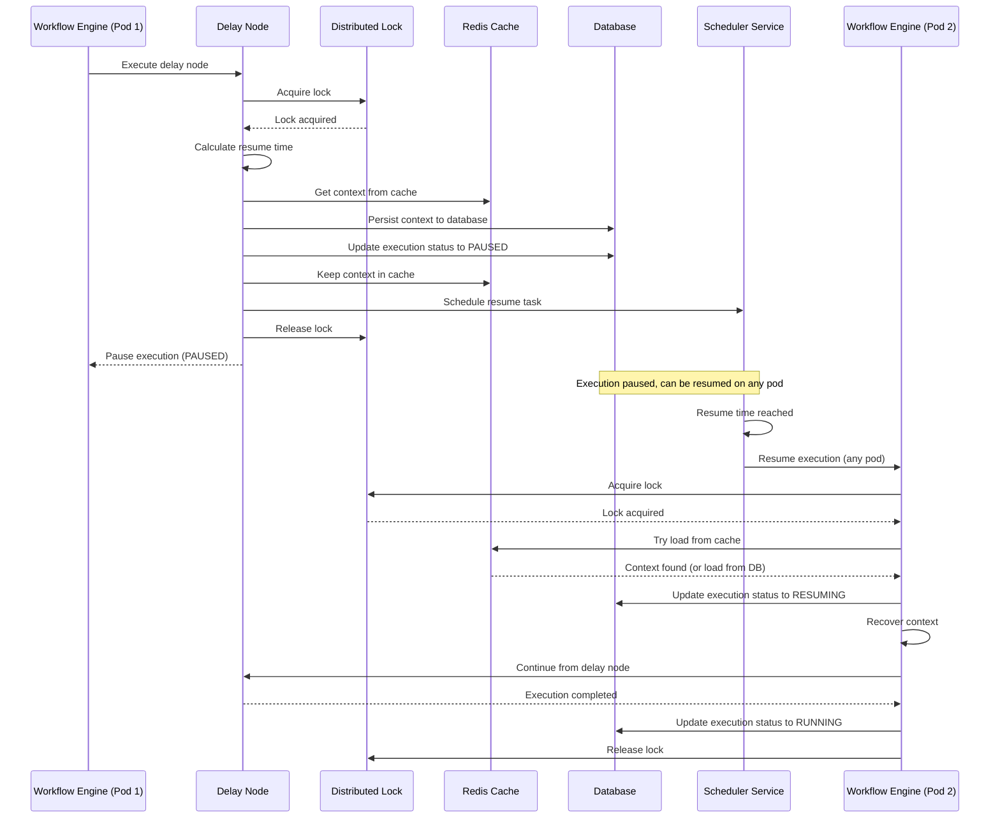

# Workflow Execution State Management

## Overview

Workflow execution state management enables **distributed pause/resume** functionality for nodes that require long-running operations (e.g., delay nodes, async operations). The system uses a combination of database persistence, Redis cache for performance, and distributed locks for data consistency, allowing execution to be paused on one pod and resumed on a different pod seamlessly.

## Design Principles

1. **Distributed**: Execution can be paused on one pod and resumed on any pod
2. **Performance**: Use Redis cache to minimize database reads during execution
3. **Data Consistency**: Use distributed locks to prevent race conditions
4. **Efficient Storage**: Only persist context to database when necessary (completed or paused)
5. **Context Recovery**: Full context recovery including trigger, execution, and workflow information
6. **Node-Level Pause**: Individual nodes can pause execution
7. **Retry Support**: Optional retry configuration for each node using Resilience4j

**See**: [Distributed Execution Management](./distributed-execution-management.md) for detailed implementation of distributed pause/resume.

## Execution State Structure

### Execution Entity

```sql
CREATE TABLE executions (
    id VARCHAR(255) PRIMARY KEY,
    workflow_id VARCHAR(255) NOT NULL REFERENCES workflows(id),
    trigger_id VARCHAR(255) REFERENCES triggers(id),
    trigger_node_id VARCHAR(255),  -- Node ID of trigger node
    status VARCHAR(50) NOT NULL,  -- RUNNING, WAITING, PAUSED, COMPLETED, FAILED
    started_at TIMESTAMP NOT NULL,
    completed_at TIMESTAMP,
    duration INTEGER,
    nodes_executed INTEGER DEFAULT 0,
    notifications_sent INTEGER DEFAULT 0,
    
    -- Comprehensive execution data (JSONB)
    context JSONB NOT NULL,  -- Full execution context
    trigger_data JSONB,  -- Data from trigger
    workflow_metadata JSONB,  -- Workflow metadata at execution time
    execution_metadata JSONB,  -- Execution-specific metadata
    
    error TEXT,
    error_details JSONB,  -- Detailed error information
    
    created_at TIMESTAMP NOT NULL DEFAULT NOW(),
    updated_at TIMESTAMP NOT NULL DEFAULT NOW()
);

-- Indexes for JSONB queries
CREATE INDEX idx_executions_context ON executions USING GIN (context);
CREATE INDEX idx_executions_trigger_data ON executions USING GIN (trigger_data);
CREATE INDEX idx_executions_workflow_metadata ON executions USING GIN (workflow_metadata);
CREATE INDEX idx_executions_status ON executions(status);
CREATE INDEX idx_executions_started_at ON executions(started_at);
```

**Note**: See [Execution Data Structure](./execution-data-structure.md) for complete data structure details and [Execution Query Capabilities](./execution-query-capabilities.md) for query examples.

### Node Execution State

```sql
CREATE TABLE node_executions (
    id VARCHAR(255) PRIMARY KEY,
    execution_id VARCHAR(255) NOT NULL REFERENCES executions(id),
    node_id VARCHAR(255) NOT NULL,
    node_label VARCHAR(255),  -- Human-readable node label
    node_type VARCHAR(50) NOT NULL,  -- trigger, logic, action
    node_sub_type VARCHAR(50),  -- api-call, condition, delay, etc.
    registry_id VARCHAR(255),  -- Registry ID for trigger/action
    
    status VARCHAR(50) NOT NULL,  -- RUNNING, WAITING, PAUSED, COMPLETED, FAILED
    started_at TIMESTAMP NOT NULL,
    completed_at TIMESTAMP,
    duration INTEGER,  -- Duration in milliseconds
    
    -- Comprehensive node execution data (JSONB)
    input_data JSONB NOT NULL,  -- Input data to the node
    output_data JSONB,  -- Output data from the node
    node_config JSONB,  -- Node configuration at execution time
    execution_context JSONB,  -- Execution context available to node
    
    error TEXT,
    error_details JSONB,  -- Detailed error information
    
    retry_count INTEGER DEFAULT 0,
    retry_details JSONB,  -- Retry attempts information
    
    created_at TIMESTAMP NOT NULL DEFAULT NOW(),
    updated_at TIMESTAMP NOT NULL DEFAULT NOW()
);

-- Indexes for JSONB queries
CREATE INDEX idx_node_executions_input_data ON node_executions USING GIN (input_data);
CREATE INDEX idx_node_executions_output_data ON node_executions USING GIN (output_data);
CREATE INDEX idx_node_executions_node_config ON node_executions USING GIN (node_config);
CREATE INDEX idx_node_executions_execution_id ON node_executions(execution_id);
CREATE INDEX idx_node_executions_node_id ON node_executions(node_id);
CREATE INDEX idx_node_executions_node_type ON node_executions(node_type);
CREATE INDEX idx_node_executions_status ON node_executions(status);
CREATE INDEX idx_node_executions_started_at ON node_executions(started_at);
```

**Note**: See [Execution Data Structure](./execution-data-structure.md) for complete data structure details and [Execution Query Capabilities](./execution-query-capabilities.md) for query examples.

### Execution Wait State

For nodes that pause execution (delay, wait-for-events):

```sql
CREATE TABLE execution_wait_states (
    id VARCHAR(255) PRIMARY KEY,
    execution_id VARCHAR(255) NOT NULL REFERENCES executions(id),
    node_id VARCHAR(255) NOT NULL,
    workflow_id VARCHAR(255) NOT NULL,
    trigger_id VARCHAR(255),
    trigger_node_id VARCHAR(255),
    wait_type VARCHAR(50) NOT NULL,  -- DELAY, WAIT_EVENTS, ASYNC_OPERATION
    resume_at TIMESTAMP NOT NULL,
    context_snapshot JSONB NOT NULL,  -- Full context snapshot
    status VARCHAR(50) NOT NULL,  -- WAITING, RESUMING, COMPLETED, TIMEOUT
    expires_at TIMESTAMP NOT NULL,
    created_at TIMESTAMP NOT NULL DEFAULT NOW(),
    updated_at TIMESTAMP NOT NULL DEFAULT NOW()
);
```

## Context Recovery

### Context Snapshot Structure

When a node pauses execution, a full context snapshot is saved:

```json
{
  "executionId": "exec-123",
  "workflowId": "workflow-456",
  "triggerId": "trigger-789",
  "triggerNodeId": "trigger-node-abc",
  "currentNodeId": "delay-node-xyz",
  "nodeOutputs": {
    "trigger-node-abc": {
      "userId": "user-123",
      "eventType": "user.created"
    },
    "previous-node": {
      "data": "some data"
    }
  },
  "variables": {
    "globalVar1": "value1",
    "globalVar2": "value2"
  },
  "metadata": {
    "startedAt": "2024-01-01T10:00:00Z",
    "executionPath": ["trigger-node-abc", "previous-node", "delay-node-xyz"]
  }
}
```

### Context Recovery Process

```java
@Service
public class ExecutionContextRecovery {
    
    public ExecutionContext recoverContext(String waitStateId) {
        ExecutionWaitState waitState = waitStateRepository.findById(waitStateId)
            .orElseThrow(() -> new ResourceNotFoundException("Wait state not found"));
        
        // Recover full context from snapshot
        Map<String, Object> contextSnapshot = waitState.getContextSnapshot();
        
        ExecutionContext context = new ExecutionContext(
            (String) contextSnapshot.get("executionId"),
            (String) contextSnapshot.get("workflowId")
        );
        
        // Restore node outputs
        Map<String, Object> nodeOutputs = (Map<String, Object>) contextSnapshot.get("nodeOutputs");
        nodeOutputs.forEach(context::setNodeOutput);
        
        // Restore variables
        Map<String, Object> variables = (Map<String, Object>) contextSnapshot.get("variables");
        variables.forEach(context::setVariable);
        
        // Restore metadata
        Map<String, Object> metadata = (Map<String, Object>) contextSnapshot.get("metadata");
        context.setMetadata(metadata);
        
        // Set trigger information
        context.setTriggerId((String) contextSnapshot.get("triggerId"));
        context.setTriggerNodeId((String) contextSnapshot.get("triggerNodeId"));
        
        return context;
    }
}
```

## Delay Node with Persistent State

### Delay Node Configuration

```json
{
  "nodeId": "delay-node-123",
  "type": "logic",
  "subType": "delay",
  "config": {
    "duration": 36000,
    "unit": "seconds",
    "persistState": true
  }
}
```

### Delay Node Execution Flow (Distributed)



### Delay Node Implementation

```java
@Component
public class DelayNodeExecutor implements NodeExecutor {
    
    private final ExecutionWaitStateRepository waitStateRepository;
    private final ExecutionContextRecovery contextRecovery;
    private final SchedulerService schedulerService;
    
    @Override
    public NodeExecutionResult execute(String nodeId, Map<String, Object> nodeData, ExecutionContext context) {
        DelayNodeConfig config = parseConfig(nodeData);
        long delaySeconds = convertToSeconds(config.getDuration(), config.getUnit());
        
        if (delaySeconds > 0) {
            // Create wait state
            ExecutionWaitState waitState = new ExecutionWaitState();
            waitState.setId(UUID.randomUUID().toString());
            waitState.setExecutionId(context.getExecutionId());
            waitState.setNodeId(nodeId);
            waitState.setWorkflowId(context.getWorkflowId());
            waitState.setTriggerId(context.getTriggerId());
            waitState.setTriggerNodeId(context.getTriggerNodeId());
            waitState.setWaitType("DELAY");
            waitState.setResumeAt(LocalDateTime.now().plusSeconds(delaySeconds));
            waitState.setExpiresAt(LocalDateTime.now().plusDays(1)); // Max 1 day delay
            
            // Create context snapshot
            Map<String, Object> contextSnapshot = createContextSnapshot(context);
            waitState.setContextSnapshot(contextSnapshot);
            waitState.setStatus("WAITING");
            
            waitStateRepository.save(waitState);
            
            // Schedule resume
            schedulerService.scheduleResume(
                waitState.getId(),
                waitState.getResumeAt()
            );
            
            return NodeExecutionResult.waiting(waitState.getId());
        }
        
        // No delay, continue immediately
        return NodeExecutionResult.success(null);
    }
    
    private Map<String, Object> createContextSnapshot(ExecutionContext context) {
        Map<String, Object> snapshot = new HashMap<>();
        snapshot.put("executionId", context.getExecutionId());
        snapshot.put("workflowId", context.getWorkflowId());
        snapshot.put("triggerId", context.getTriggerId());
        snapshot.put("triggerNodeId", context.getTriggerNodeId());
        snapshot.put("currentNodeId", context.getCurrentNodeId());
        snapshot.put("nodeOutputs", context.getNodeOutputs());
        snapshot.put("variables", context.getVariables());
        snapshot.put("metadata", context.getMetadata());
        return snapshot;
    }
}
```

### Resume Execution

```java
@Service
public class ExecutionResumeService {
    
    private final ExecutionWaitStateRepository waitStateRepository;
    private final ExecutionContextRecovery contextRecovery;
    private final WorkflowExecutor workflowExecutor;
    
    @Scheduled(fixedDelay = 60000) // Check every minute
    public void checkAndResumeExecutions() {
        LocalDateTime now = LocalDateTime.now();
        List<ExecutionWaitState> readyToResume = waitStateRepository
            .findByStatusAndResumeAtBefore("WAITING", now);
        
        for (ExecutionWaitState waitState : readyToResume) {
            resumeExecution(waitState);
        }
    }
    
    public void resumeExecution(String waitStateId) {
        ExecutionWaitState waitState = waitStateRepository.findById(waitStateId)
            .orElseThrow(() -> new ResourceNotFoundException("Wait state not found"));
        resumeExecution(waitState);
    }
    
    private void resumeExecution(ExecutionWaitState waitState) {
        // Mark as resuming (optimistic locking)
        waitState.setStatus("RESUMING");
        waitState.setResumedAt(LocalDateTime.now());
        waitState.setResumedBy(getInstanceId());
        waitStateRepository.save(waitState);
        
        try {
            // Recover context
            ExecutionContext context = contextRecovery.recoverContext(waitState.getId());
            
            // Load workflow
            Workflow workflow = workflowRepository.findById(waitState.getWorkflowId())
                .orElseThrow(() -> new ResourceNotFoundException("Workflow not found"));
            
            // Resume execution from the node
            workflowExecutor.resumeExecution(
                workflow,
                context,
                waitState.getNodeId()
            );
            
            // Mark as completed
            waitState.setStatus("COMPLETED");
            waitStateRepository.save(waitState);
        } catch (Exception e) {
            log.error("Failed to resume execution: waitStateId={}", waitState.getId(), e);
            waitState.setStatus("FAILED");
            waitStateRepository.save(waitState);
        }
    }
}
```

## Node Retry Configuration

### Retry Configuration Structure

Each node can optionally define retry logic using Resilience4j:

```json
{
  "nodeId": "api-call-node-123",
  "type": "action",
  "subType": "api-call",
  "config": {
    "url": "https://api.example.com/users",
    "method": "POST",
    "retry": {
      "enabled": true,
      "maxAttempts": 3,
      "waitDuration": 1000,
      "exponentialBackoff": true,
      "multiplier": 2.0,
      "retryOn": ["IOException", "TimeoutException", "5xx"],
      "ignoreExceptions": ["IllegalArgumentException"]
    }
  }
}
```

### Retry Configuration Options

- **enabled**: Enable/disable retry (default: false)
- **maxAttempts**: Maximum number of retry attempts (default: 3)
- **waitDuration**: Initial wait duration in milliseconds (default: 1000)
- **exponentialBackoff**: Use exponential backoff (default: true)
- **multiplier**: Backoff multiplier for exponential backoff (default: 2.0)
- **retryOn**: List of exceptions/status codes to retry on
- **ignoreExceptions**: List of exceptions to not retry on

### Retry Implementation with Resilience4j

```java
@Component
public class RetryableNodeExecutor {
    
    private final RetryRegistry retryRegistry;
    
    public NodeExecutionResult executeWithRetry(
        String nodeId,
        Map<String, Object> nodeData,
        ExecutionContext context,
        NodeExecutor nodeExecutor
    ) {
        NodeRetryConfig retryConfig = parseRetryConfig(nodeData);
        
        if (retryConfig == null || !retryConfig.isEnabled()) {
            // No retry, execute directly
            return nodeExecutor.execute(nodeId, nodeData, context);
        }
        
        // Create retry configuration
        RetryConfig config = RetryConfig.custom()
            .maxAttempts(retryConfig.getMaxAttempts())
            .waitDuration(Duration.ofMillis(retryConfig.getWaitDuration()))
            .exponentialBackoff(
                Duration.ofMillis(retryConfig.getWaitDuration()),
                retryConfig.getMultiplier()
            )
            .retryOnException(throwable -> shouldRetry(throwable, retryConfig))
            .ignoreExceptions(throwable -> shouldIgnore(throwable, retryConfig))
            .build();
        
        Retry retry = retryRegistry.retry(nodeId, config);
        
        try {
            return Retry.decorateSupplier(retry, () -> {
                try {
                    return nodeExecutor.execute(nodeId, nodeData, context);
                } catch (Exception e) {
                    throw new RuntimeException(e);
                }
            }).get();
        } catch (Exception e) {
            return NodeExecutionResult.failure(e.getMessage());
        }
    }
    
    private boolean shouldRetry(Throwable throwable, NodeRetryConfig config) {
        if (config.getRetryOn() == null || config.getRetryOn().isEmpty()) {
            return true; // Retry on all exceptions by default
        }
        
        String exceptionName = throwable.getClass().getSimpleName();
        return config.getRetryOn().contains(exceptionName) ||
               config.getRetryOn().contains(throwable.getClass().getName());
    }
    
    private boolean shouldIgnore(Throwable throwable, NodeRetryConfig config) {
        if (config.getIgnoreExceptions() == null || config.getIgnoreExceptions().isEmpty()) {
            return false;
        }
        
        String exceptionName = throwable.getClass().getSimpleName();
        return config.getIgnoreExceptions().contains(exceptionName) ||
               config.getIgnoreExceptions().contains(throwable.getClass().getName());
    }
}
```

### Retry for HTTP Calls

For API call actions, retry can be configured for HTTP status codes:

```json
{
  "retry": {
    "enabled": true,
    "maxAttempts": 3,
    "waitDuration": 1000,
    "exponentialBackoff": true,
    "retryOn": ["5xx", "408", "429"],
    "ignoreExceptions": ["4xx"]
  }
}
```

```java
public class ApiCallNodeExecutor implements NodeExecutor {
    
    private final RetryableNodeExecutor retryableExecutor;
    
    @Override
    public NodeExecutionResult execute(String nodeId, Map<String, Object> nodeData, ExecutionContext context) {
        return retryableExecutor.executeWithRetry(nodeId, nodeData, context, this::executeApiCall);
    }
    
    private NodeExecutionResult executeApiCall(String nodeId, Map<String, Object> nodeData, ExecutionContext context) {
        ApiCallConfig config = parseConfig(nodeData);
        
        try {
            HttpResponse response = httpClient.execute(config);
            
            // Check if should retry based on status code
            if (shouldRetryOnStatusCode(response.getStatusCode(), config.getRetryConfig())) {
                throw new RetryableException("HTTP " + response.getStatusCode());
            }
            
            return NodeExecutionResult.success(response.getBody());
        } catch (Exception e) {
            throw new RuntimeException(e);
        }
    }
    
    private boolean shouldRetryOnStatusCode(int statusCode, NodeRetryConfig retryConfig) {
        if (retryConfig == null || !retryConfig.isEnabled()) {
            return false;
        }
        
        String statusCodeStr = String.valueOf(statusCode);
        return retryConfig.getRetryOn().contains(statusCodeStr) ||
               (statusCode >= 500 && retryConfig.getRetryOn().contains("5xx")) ||
               (statusCode >= 400 && statusCode < 500 && retryConfig.getRetryOn().contains("4xx"));
    }
}
```

## Execution State Persistence

### State Persistence Points

1. **Before Node Execution**: Save execution state before executing node
2. **After Node Execution**: Save execution state after node completes
3. **On Pause**: Save full context snapshot when node pauses
4. **On Error**: Save error state and context for debugging

### State Recovery on Resume

```java
@Service
public class WorkflowExecutor {
    
    public void resumeExecution(Workflow workflow, ExecutionContext context, String fromNodeId) {
        log.info("Resuming execution: executionId={}, workflowId={}, fromNodeId={}, triggerId={}, triggerNodeId={}",
            context.getExecutionId(), context.getWorkflowId(), fromNodeId,
            context.getTriggerId(), context.getTriggerNodeId());
        
        // Load execution
        Execution execution = executionRepository.findById(context.getExecutionId())
            .orElseThrow(() -> new ResourceNotFoundException("Execution not found"));
        
        // Update status
        execution.setStatus(ExecutionStatus.RUNNING);
        executionRepository.save(execution);
        
        // Continue execution from the node
        continueExecution(workflow, execution, context, fromNodeId);
    }
}
```

## Benefits

1. **Scalability**: Execution can be paused and resumed on any instance
2. **Long-Running Operations**: Support for delays and async operations
3. **Fault Tolerance**: State persistence enables recovery from failures
4. **Context Preservation**: Full context recovery including trigger, execution, and workflow information
5. **Retry Support**: Optional retry configuration for each node using Resilience4j

## Related Documentation

- [Distributed Execution Management](./distributed-execution-management.md) - Distributed pause/resume with Redis cache and distributed locks
- [Execution Data Structure](./execution-data-structure.md) - Complete execution data structure details
- [Execution Query Capabilities](./execution-query-capabilities.md) - Query capabilities using PostgreSQL JSON functions
- [Workflow Builder](./workflow-builder.md) - Workflow builder feature
- [Node Types](./node-types.md) - Node type specifications
- [Triggers](./triggers.md) - Trigger details
- [Analytics](./analytics.md) - Analytics and reporting
- [Workflow Report](./workflow-report.md) - Report generation

