# Workflow Context Management

## Tổng quan

Workflow context là một cơ chế để lưu trữ và chia sẻ dữ liệu giữa các node trong quá trình thực thi workflow. Context được quản lý bởi `ExecutionContext` và tự động được truyền cho mỗi node khi thực thi.

**Lưu ý quan trọng:** Một workflow có thể có nhiều trigger nodes, vì vậy trigger data phải được chỉ định rõ ràng theo trigger nodeId. Trigger data được lưu như node output và có thể truy cập qua `_nodeOutputs.{triggerNodeId}`.

### Context Flow Diagram

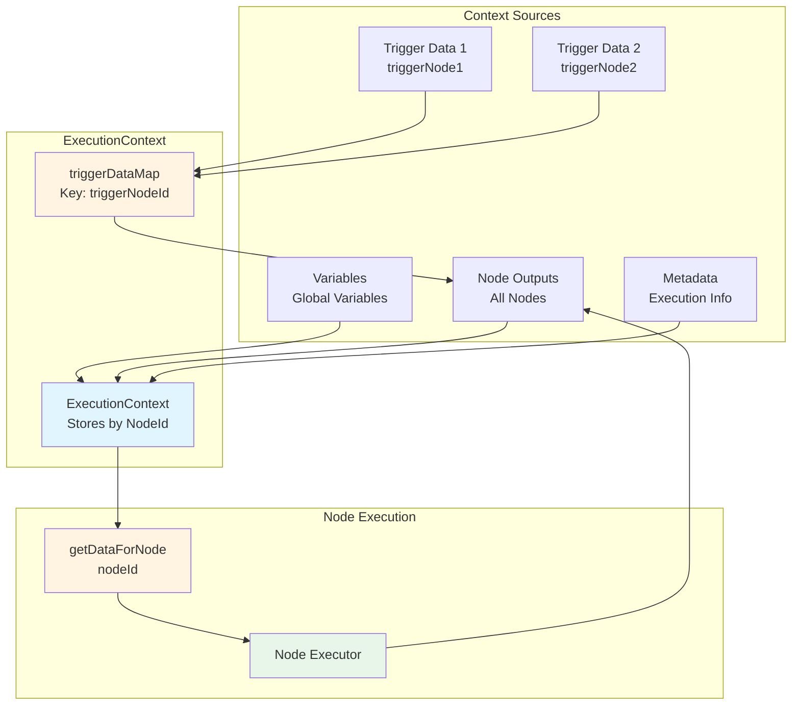

## Cấu trúc Context

Context được tổ chức thành các phần chính:

```java
ExecutionContext {
    executionId: String
    workflowId: String
    variables: Map<String, Object>                    // Biến global của workflow
    nodeOutputs: Map<String, Object>                  // Output từ mỗi node (key = nodeId)
    triggerDataMap: Map<String, Map<String, Object>> // Trigger data theo trigger nodeId
    metadata: Map<String, Object>                     // Metadata của execution
}
```

**Lưu ý:** 
- `triggerDataMap` lưu trigger data theo trigger nodeId để hỗ trợ nhiều trigger nodes
- Trigger data được lưu vào `nodeOutputs` khi trigger node được thực thi
- Các node khác truy cập trigger data qua `_nodeOutputs.{triggerNodeId}`

### Context Structure Diagram

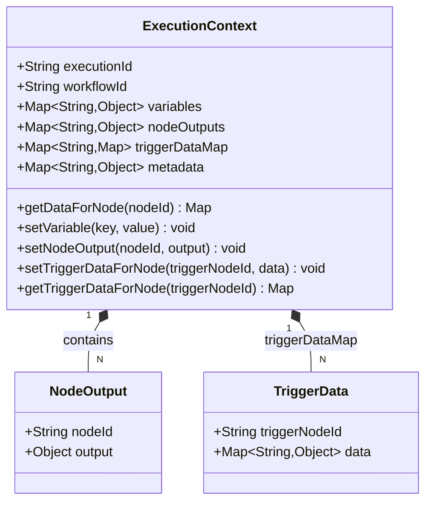

## Cách Context được Truyền cho Node

Khi một node được thực thi, method `getDataForNode(nodeId)` được gọi để tạo một Map chứa tất cả dữ liệu có sẵn:

```java
public Map<String, Object> getDataForNode(String nodeId) {
    Map<String, Object> data = new HashMap<>();
    // Variables là global, có sẵn cho tất cả nodes
    data.putAll(variables);
    // Node outputs bao gồm cả trigger node outputs
    // Trigger data được truy cập qua _nodeOutputs.{triggerNodeId}
    data.put("_nodeOutputs", nodeOutputs);
    // Metadata cho execution info
    data.put("_metadata", metadata);
    return data;
}
```

**Lưu ý quan trọng:**
- Trigger data **KHÔNG** được merge trực tiếp vào context data
- Trigger data được lưu như node output khi trigger node được thực thi
- Để truy cập trigger data, sử dụng `_nodeOutputs.{triggerNodeId}.{fieldPath}`

### Data Merging Flow

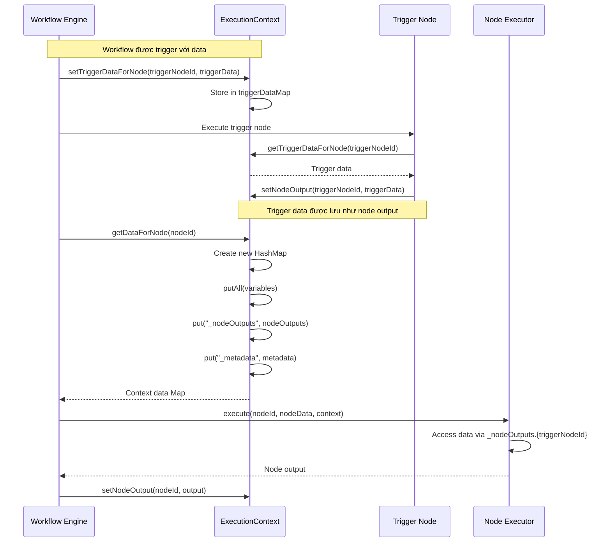

**Lưu ý quan trọng:**
- Trigger data được lưu vào `triggerDataMap` theo trigger nodeId khi workflow được trigger
- Khi trigger node được thực thi, trigger data được lưu vào `nodeOutputs` như các node khác
- Dữ liệu được merge theo thứ tự: `variables` → `_nodeOutputs` → `_metadata`
- `_nodeOutputs` là một Map với key là `nodeId` và value là output của node đó (bao gồm cả trigger nodes)

### Data Priority

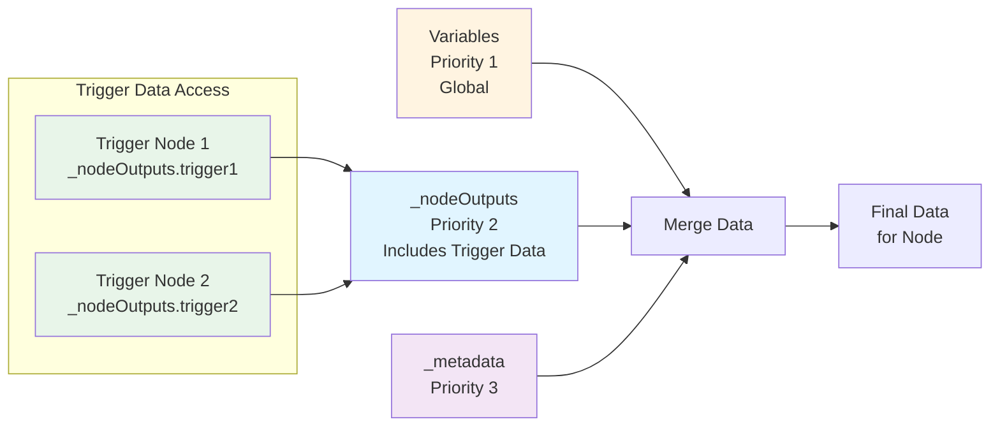

**Lưu ý:**
- Trigger data được truy cập qua `_nodeOutputs.{triggerNodeId}`, không phải ở level cao nhất
- Điều này cho phép workflow có nhiều trigger nodes với data riêng biệt

## Cách Sử dụng Field từ Node Khác

### 1. Truy cập qua `_nodeOutputs`

Để sử dụng output từ một node khác, bạn cần truy cập qua `_nodeOutputs`:

**Cú pháp:**
```
_nodeOutputs.{nodeId}.{fieldPath}
```

**Ví dụ:**
- Node A có output: `{ "userId": "123", "user": { "name": "John", "email": "john@example.com" } }`
- Node B muốn sử dụng `userId` từ Node A:
  ```
  _nodeOutputs.nodeA.userId
  ```
- Node B muốn sử dụng `email` từ Node A:
  ```
  _nodeOutputs.nodeA.user.email
  ```

### Field Access Flow

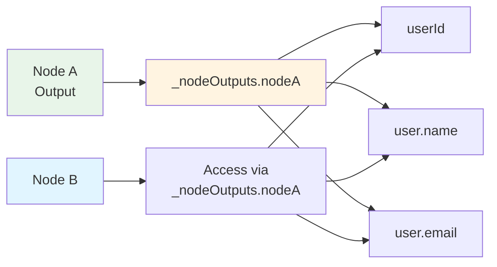

### 2. Sử dụng trong Template (Action Nodes)

Trong các action node (send_email, send_sms, send_webhook), bạn có thể sử dụng **MVEL expression syntax `@{...}`**:

**Ví dụ trong Send Email node với trigger data:**
```json
{
  "type": "action",
  "data": {
    "subtype": "send_email",
    "subject": "Welcome @{_trigger.user.name}!",
    "body": "Your user ID is @{_trigger.userId}"
  }
}
```

**Ví dụ với previous node outputs:**
```json
{
  "type": "action",
  "data": {
    "subtype": "send_email",
    "subject": "Daily Report - @{_trigger.date}",
    "body": "User @{fetchUser.userId} was created"
  }
}
```

**Ví dụ trong Send Webhook node:**
```json
{
  "type": "action",
  "data": {
    "subtype": "send_webhook",
    "url": "https://api.example.com/users",
    "method": "POST",
    "body": {
      "userId": "@{fetchUser.userId}",
      "userName": "@{fetchUser.user.name}"
    }
  }
}
```

**Note**: 
- Old syntax `{{_nodeOutputs.nodeId.field}}` → New syntax `@{nodeId.field}`
- Trigger data: `@{_trigger.field}` thay vì `{{_nodeOutputs.triggerId.field}}`
- Previous node outputs: `@{nodeId.field}` thay vì `{{_nodeOutputs.nodeId.field}}`

### Template Rendering Flow

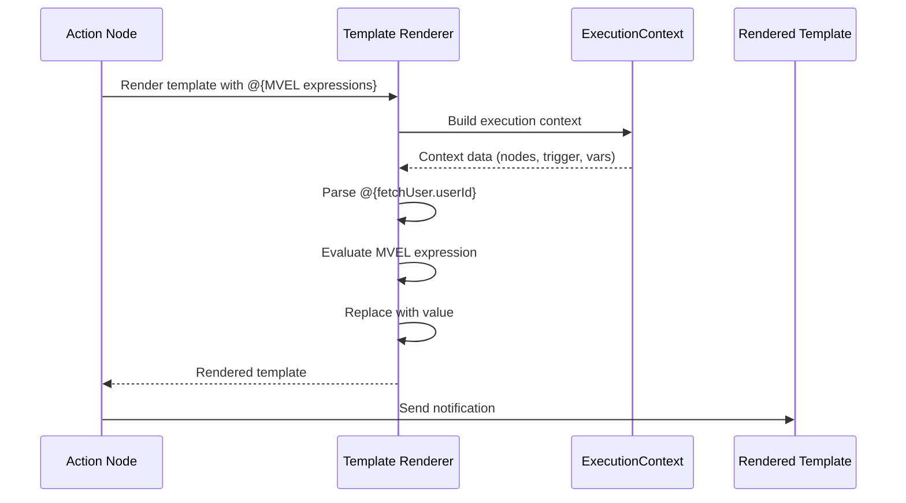

### 3. Sử dụng trong Logic Nodes (Condition/Switch)

Trong condition node, bạn có thể reference field từ node khác:

**Ví dụ Condition node với trigger data:**
```json
{
  "type": "logic",
  "data": {
    "subtype": "condition",
    "field": "_nodeOutputs.apiTrigger.user.status",
    "operator": "equals",
    "value": "active"
  }
}
```

**Ví dụ Switch node với trigger data:**
```json
{
  "type": "logic",
  "data": {
    "subtype": "switch",
    "field": "_nodeOutputs.apiTrigger.user.role",
    "cases": [
      { "value": "admin", "nodeId": "adminNode" },
      { "value": "user", "nodeId": "userNode" }
    ]
  }
}
```

### Condition Node Flow

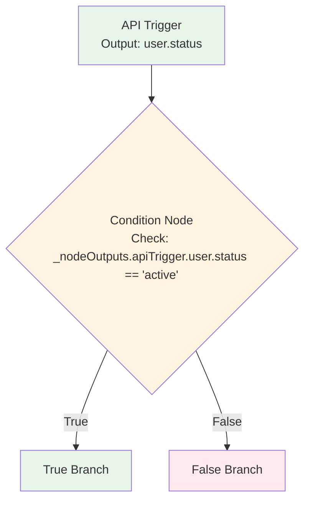

### 4. Sử dụng trong Data Nodes (Map/Transform)

Trong data transformation nodes, bạn có thể map field từ node khác:

**Ví dụ Map node:**
```json
{
  "type": "data",
  "data": {
    "subtype": "map",
    "mapping": {
      "targetUserId": "_nodeOutputs.nodeA.userId",
      "targetUserName": "_nodeOutputs.nodeA.user.name",
      "targetEmail": "_nodeOutputs.nodeA.user.email"
    }
  }
}
```

**Ví dụ Transform node với MVEL:**
```json
{
  "type": "data",
  "data": {
    "subtype": "transform",
    "transform": {
      "fullName": "@{nodeA.user.name}",
      "contact": "@{nodeA.user.email}"
    }
  }
}
```

### 5. Sử dụng trong Filter Node

Trong filter node, bạn có thể filter dựa trên field từ node khác sử dụng MVEL:

```json
{
  "type": "data",
  "data": {
    "subtype": "filter",
    "arrayField": "nodeA.items",
    "condition": "@{item.status} == @{nodeB.status}"
  }
}
```

## Các Cách Truy cập Dữ liệu Khác

### 1. Truy cập Trigger Data

**Quan trọng:** Trigger data phải được chỉ định rõ trigger nodeId vì một workflow có thể có nhiều trigger nodes. Trigger data được lưu như node output và truy cập qua `_nodeOutputs.{triggerNodeId}`.

**Cú pháp:**
```
_nodeOutputs.{triggerNodeId}.{fieldPath}
```

**Ví dụ với một trigger node:**
```json
// Workflow có trigger node với id = "apiTrigger"
// Trigger data: { "event": "user.created", "userId": "123" }
// Truy cập trigger data:
{
  "field": "_nodeOutputs.apiTrigger.userId",  // userId từ trigger
  "field": "_nodeOutputs.apiTrigger.event"   // event từ trigger
}
```

**Ví dụ với nhiều trigger nodes:**
```json
// Workflow có 2 trigger nodes:
// - "apiTrigger": { "event": "user.created", "userId": "123" }
// - "scheduleTrigger": { "time": "2024-01-01", "action": "daily" }

// Truy cập trigger data từ apiTrigger:
{
  "field": "_nodeOutputs.apiTrigger.userId",
  "field": "_nodeOutputs.apiTrigger.event"
}

// Truy cập trigger data từ scheduleTrigger:
{
  "field": "_nodeOutputs.scheduleTrigger.time",
  "field": "_nodeOutputs.scheduleTrigger.action"
}
```

### Multiple Triggers Flow

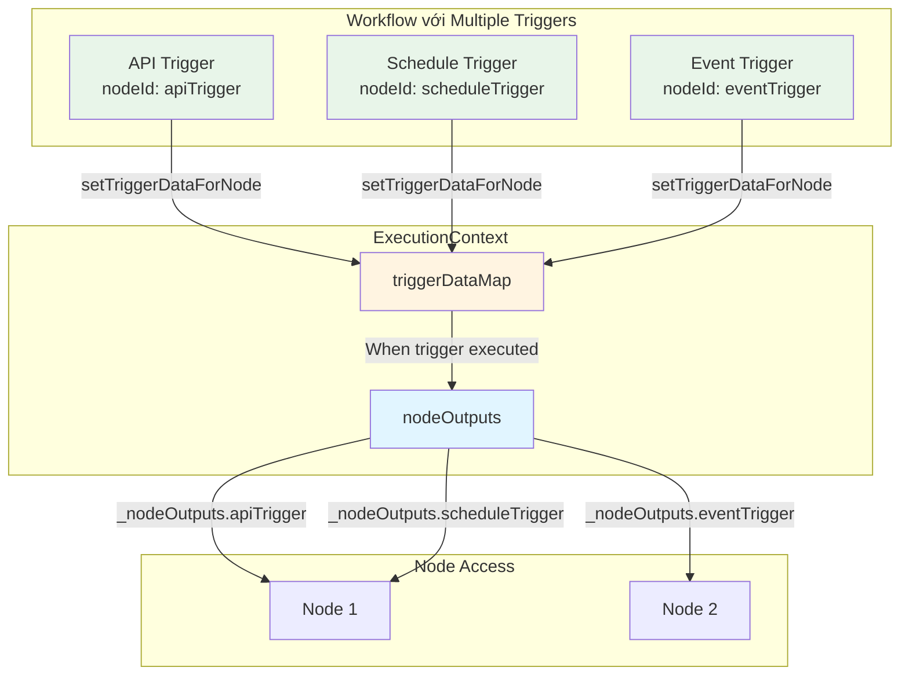

### 2. Truy cập Variables

Biến global được lưu trong `variables` và cũng được merge vào context:

```json
// Set variable trong một node:
context.setVariable("apiKey", "secret-key-123");

// Sử dụng trong node khác với MVEL:
{
  "url": "https://api.example.com?key=@{_vars.apiKey}"
}
```

### Variable Sharing Flow

```mermaid
graph LR
    NODE1[Node 1] --> SET[setVariable<br/>apiKey = 'secret']
    SET --> EC[ExecutionContext<br/>variables]
    EC --> NODE2[Node 2]
    NODE2 --> USE[Use @{_vars.apiKey}]
    
    style SET fill:#e8f5e9
    style EC fill:#fff4e1
    style USE fill:#e1f5ff
```

### 3. Truy cập Metadata

Metadata chứa thông tin về execution:

```json
// Metadata tự động có sẵn:
{
  "_metadata": {
    "executionId": "...",
    "workflowId": "...",
    "startedAt": "..."
  }
}
```

## Lưu ý Quan trọng

### 1. Multiple Triggers Support

Một workflow có thể có nhiều trigger nodes, mỗi trigger node có data riêng biệt:

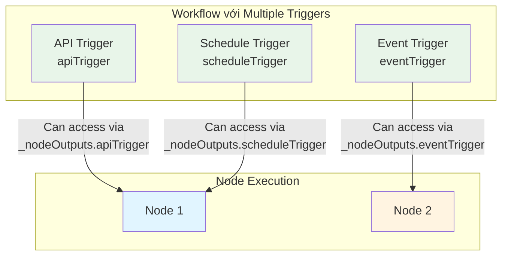

**Lưu ý:**
- Mỗi trigger node phải có nodeId duy nhất
- Trigger data được lưu riêng biệt theo trigger nodeId
- Các node khác truy cập trigger data qua MVEL: `@{_trigger.field}` hoặc `@{triggerNodeId.field}` (nếu có nhiều triggers)
- Khi workflow được trigger, chỉ trigger node tương ứng được thực thi

### 2. Thứ tự Thực thi

```mermaid
graph TB
    TRIGGER[Trigger Node<br/>apiTrigger] --> NODE1[Node 1]
    NODE1 --> NODE2[Node 2]
    NODE2 --> NODE3[Node 3]
    
    NODE1 -.->|Can access via<br/>@{_trigger.field}| TRIGGER
    NODE2 -.->|Can access via<br/>@{_trigger.field}| TRIGGER
    NODE2 -.->|Can access via<br/>@{node1.field}| NODE1
    NODE3 -.->|Can access via<br/>@{_trigger.field}| TRIGGER
    NODE3 -.->|Can access via<br/>@{node1.field}| NODE1
    NODE3 -.->|Can access via<br/>@{node2.field}| NODE2
    
    NODE1 -.->|Cannot access| NODE2
    NODE1 -.->|Cannot access| NODE3
    NODE2 -.->|Cannot access| NODE3
    
    style TRIGGER fill:#e8f5e9
    style NODE1 fill:#e1f5ff
    style NODE2 fill:#fff4e1
    style NODE3 fill:#f3e5f5
```

- Node chỉ có thể truy cập output từ các node đã được thực thi trước đó
- Nếu node A chưa được thực thi, `_nodeOutputs.nodeA` sẽ không tồn tại
- Trigger node được thực thi đầu tiên, sau đó trigger data có sẵn qua `_nodeOutputs.{triggerNodeId}`
- Workflow executor tự động đảm bảo thứ tự thực thi dựa trên edges trong workflow definition

### 3. Nested Field Access

Hỗ trợ truy cập nested field bằng dot notation:

```
_nodeOutputs.nodeA.user.name
_nodeOutputs.nodeA.items[0].id
_nodeOutputs.nodeA.data.user.email
```

### Nested Field Access Diagram

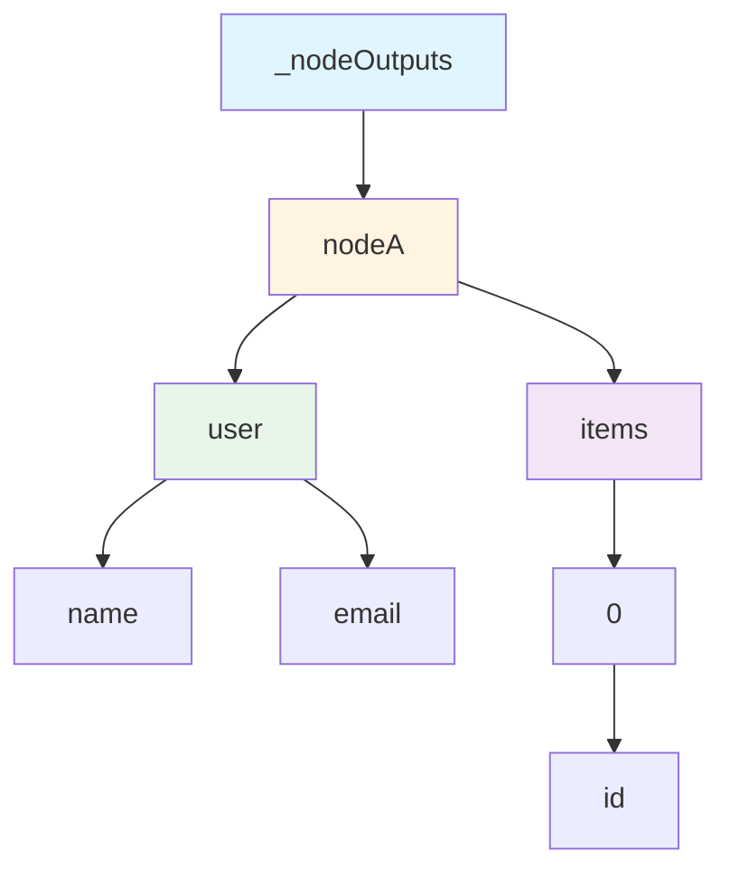

### 4. MVEL Expression Rendering

MVEL expression renderer hỗ trợ:
- Simple variables: `@{variable}`
- Nested variables: `@{user.name}`
- Node outputs: `@{nodeId.field}`
- Trigger data: `@{_trigger.field}`
- Workflow variables: `@{_vars.varName}`
- Built-in functions: `@{_now()}`, `@{_uuid()}`
- Complex expressions: `@{user.firstName} + ' ' + @{user.lastName}`
- Ternary operators: `@{user.age} >= 18 ? 'adult' : 'minor'`

### 5. Error Handling

- Nếu field không tồn tại, MVEL evaluation sẽ throw exception với detailed error message
- Nên sử dụng null-safe operators: `@{user?.name ?: 'unknown'}`
- Hoặc conditional expressions: `@{user.name != null ? user.name : 'unknown'}`

## Ví dụ Hoàn chỉnh

### Workflow: User Registration Notification

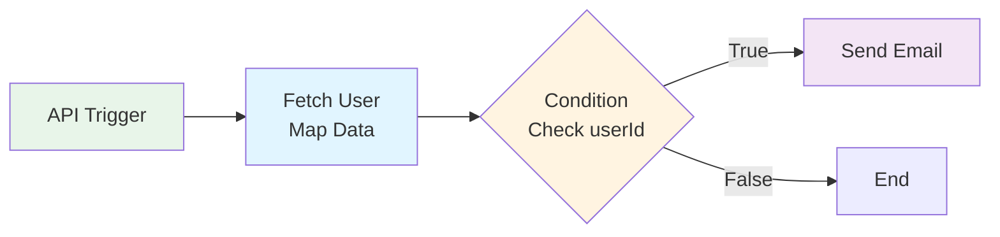

**Workflow Definition:**
```json
{
  "nodes": [
    {
      "id": "apiTrigger",
      "type": "trigger",
      "data": {
        "type": "api"
      }
    },
    {
      "id": "fetchUser",
      "type": "data",
      "data": {
        "subtype": "map",
        "mapping": {
          "userId": "@{_trigger.userId}",
          "userName": "@{_trigger.name}"
        }
      }
    },
    {
      "id": "checkStatus",
      "type": "logic",
      "data": {
        "subtype": "condition",
        "field": "fetchUser.userId",
        "condition": "@{fetchUser.userId} != null",
        "operator": "not_equals",
        "value": null,
        "branches": {
          "true": "sendEmail",
          "false": "end"
        }
      }
    },
    {
      "id": "sendEmail",
      "type": "action",
      "data": {
        "subtype": "send_email",
        "recipients": [
          {
            "email": "@{fetchUser.userName}@example.com"
          }
        ],
        "subject": "Welcome @{fetchUser.userName}!",
        "body": "Your user ID is @{fetchUser.userId}"
      }
    }
  ],
  "edges": [
    { "source": "apiTrigger", "target": "fetchUser" },
    { "source": "fetchUser", "target": "checkStatus" },
    { "source": "checkStatus", "target": "sendEmail", "sourceHandle": "true" }
  ]
}
```

### Execution Flow với Context

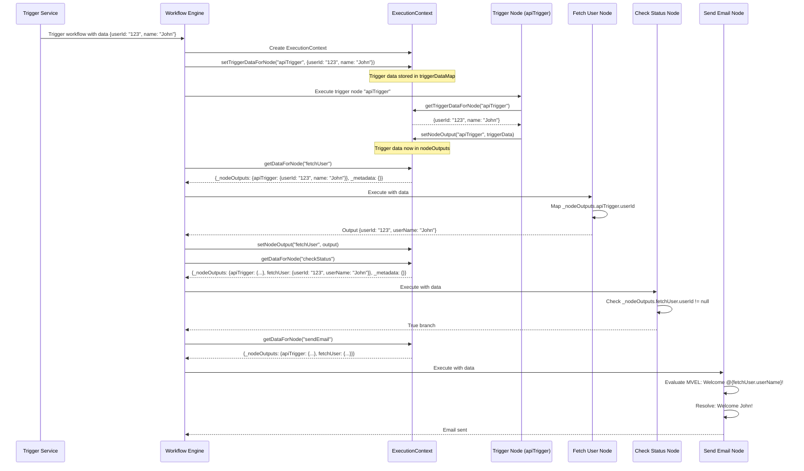

## Best Practices

1. **Đặt tên trigger node rõ ràng**: Sử dụng tên trigger node mô tả để dễ reference (ví dụ: `apiTrigger`, `scheduleTrigger`, `eventTrigger` thay vì `trigger1`, `trigger2`)

2. **Luôn chỉ định trigger nodeId**: Khi truy cập trigger data, luôn sử dụng `_nodeOutputs.{triggerNodeId}` thay vì truy cập trực tiếp

3. **Kiểm tra null**: Luôn sử dụng default values trong template để tránh lỗi khi trigger data không tồn tại

4. **Tổ chức output**: Cấu trúc output của node một cách có tổ chức để dễ truy cập

5. **Sử dụng Map node**: Sử dụng Map node để transform và chuẩn hóa dữ liệu từ trigger trước khi sử dụng

6. **Logging**: Kiểm tra execution context trong logs để debug, đặc biệt là `triggerDataMap` và `nodeOutputs`

## Debugging

Để debug context, bạn có thể:

1. Kiểm tra execution context trong database:
```sql
SELECT context FROM executions WHERE id = 'execution-id';
```

2. Kiểm tra node outputs:
```sql
SELECT node_id, output_data FROM node_executions WHERE execution_id = 'execution-id';
```

3. Xem logs trong backend:
```java
logger.debug("Context data for node {}: {}", nodeId, context.getDataForNode(nodeId));
```

### Debugging Flow

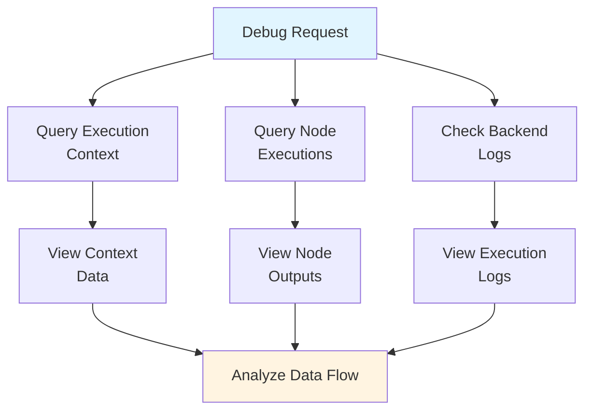

## Related Documentation

- [Backend Overview](./overview.md) - Backend technical overview
- [Workflow Builder Feature](../../features/workflow-builder.md) - Workflow builder feature
- [Workflow Execution](../../architecture/overview.md#workflow-execution-flow) - Workflow execution flow

