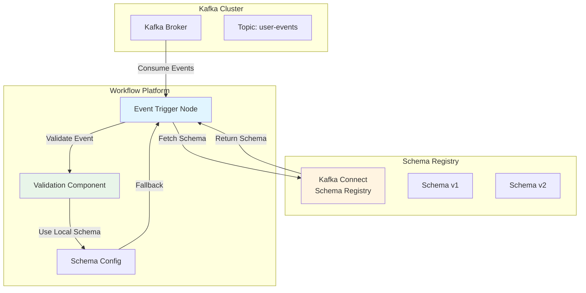

# Kafka Connect Integration for Event Triggers

## Overview

Kafka Connect integration enables the workflow platform to use schema registry for event trigger nodes. This provides schema validation, evolution, and compatibility checking for Kafka events.

## Architecture



## Configuration

### Event Trigger Node Configuration

```json
{
  "nodeId": "event-trigger-123",
  "nodeType": "trigger",
  "subType": "event",
  "config": {
    "kafka": {
      "brokers": ["localhost:9092"],
      "topic": "user-events",
      "consumerGroup": "workflow-consumer-group",
      "offset": "latest"
    },
    "kafkaConnect": {
      "enabled": true,
      "schemaRegistryUrl": "http://localhost:8081",
      "subject": "user-events-value",
      "version": "latest",
      "format": "avro",
      "fallbackToLocalSchema": true
    },
    "schemas": [
      {
        "schemaId": "user-created",
        "eventType": "user.created",
        "fields": [...]
      }
    ]
  }
}
```

### Configuration Options

- **enabled**: Enable/disable Kafka Connect integration
- **schemaRegistryUrl**: URL of the schema registry (e.g., `http://localhost:8081`)
- **subject**: Schema subject name (typically `{topic}-value` or `{topic}-key`)
- **version**: Schema version to use (`latest`, `1`, `2`, etc.)
- **format**: Schema format (`avro`, `json`, `protobuf`)
- **fallbackToLocalSchema**: Use local schema definition if registry unavailable

## Schema Registry Integration Flow

### 1. Schema Retrieval

```java
// Pseudo-code for schema retrieval
public Schema getSchemaFromRegistry(KafkaConnectConfig config) {
    try {
        SchemaRegistryClient client = new SchemaRegistryClient(config.getSchemaRegistryUrl());
        Schema schema = client.getSchema(config.getSubject(), config.getVersion());
        return schema;
    } catch (SchemaRegistryException e) {
        if (config.isFallbackToLocalSchema()) {
            return getLocalSchema(config);
        }
        throw e;
    }
}
```

### 2. Event Validation

```java
// Validate incoming event against schema
public ValidationResult validateEvent(Object event, Schema schema) {
    try {
        // Deserialize event using schema
        Object deserialized = deserialize(event, schema);
        
        // Validate against schema
        ValidationResult result = schemaValidator.validate(deserialized, schema);
        
        return result;
    } catch (ValidationException e) {
        return ValidationResult.failure(e.getMessage());
    }
}
```

### 3. Schema Matching

When multiple schemas are defined for a topic:

```java
// Match event to appropriate schema
public Schema matchSchema(Object event, List<Schema> schemas) {
    for (Schema schema : schemas) {
        if (matchesFilter(event, schema.getFilter())) {
            return schema;
        }
    }
    return null; // No matching schema
}
```

## Schema Formats

### Avro Schema

```json
{
  "type": "record",
  "name": "UserCreated",
  "fields": [
    {
      "name": "eventType",
      "type": "string"
    },
    {
      "name": "userId",
      "type": "string"
    },
    {
      "name": "email",
      "type": "string"
    },
    {
      "name": "timestamp",
      "type": "long",
      "logicalType": "timestamp-millis"
    }
  ]
}
```

### JSON Schema

```json
{
  "$schema": "http://json-schema.org/draft-07/schema#",
  "type": "object",
  "properties": {
    "eventType": {
      "type": "string"
    },
    "userId": {
      "type": "string"
    },
    "email": {
      "type": "string",
      "format": "email"
    },
    "timestamp": {
      "type": "integer",
      "format": "date-time"
    }
  },
  "required": ["eventType", "userId", "email", "timestamp"]
}
```

### Protobuf Schema

```protobuf
syntax = "proto3";

message UserCreated {
  string eventType = 1;
  string userId = 2;
  string email = 3;
  int64 timestamp = 4;
}
```

## Error Handling

### Schema Registry Unavailable

When schema registry is unavailable:

1. Check `fallbackToLocalSchema` configuration
2. If enabled, use local schema definition from node config
3. If disabled, fail event processing with error

### Schema Mismatch

When event doesn't match schema:

1. Log validation error
2. Optionally send to dead letter queue
3. Continue processing other events

### Schema Evolution

Handle schema version changes:

1. Support multiple schema versions
2. Validate compatibility (backward/forward)
3. Transform events if needed
4. Log schema version mismatches

## Implementation Details

### Backend Service

```java
@Service
public class KafkaConnectService {
    
    private final SchemaRegistryClient schemaRegistryClient;
    private final SchemaValidator schemaValidator;
    
    public Schema getSchema(KafkaConnectConfig config) {
        if (config.isEnabled()) {
            try {
                return schemaRegistryClient.getSchema(
                    config.getSubject(),
                    config.getVersion()
                );
            } catch (Exception e) {
                if (config.isFallbackToLocalSchema()) {
                    return getLocalSchema(config);
                }
                throw new SchemaRegistryException("Failed to fetch schema", e);
            }
        }
        return getLocalSchema(config);
    }
    
    public ValidationResult validateEvent(Object event, Schema schema) {
        return schemaValidator.validate(event, schema);
    }
    
    private Schema getLocalSchema(KafkaConnectConfig config) {
        // Get schema from node configuration
        return config.getLocalSchema();
    }
}
```

### Event Consumer Integration

```java
@Component
public class KafkaEventConsumer {
    
    private final KafkaConnectService kafkaConnectService;
    
    @KafkaListener(topics = "#{@topicResolver.resolve()}")
    public void consumeEvent(
        @Payload String message,
        @Header("kafka_receivedTopic") String topic
    ) {
        // Get schema from registry or local config
        Schema schema = kafkaConnectService.getSchema(topic);
        
        // Validate event
        ValidationResult validation = kafkaConnectService.validateEvent(message, schema);
        
        if (validation.isValid()) {
            // Process event
            processEvent(message, schema);
        } else {
            // Handle validation error
            handleValidationError(message, validation);
        }
    }
}
```

## Testing

### Unit Tests

```java
@Test
public void testSchemaRetrieval() {
    KafkaConnectConfig config = new KafkaConnectConfig();
    config.setEnabled(true);
    config.setSchemaRegistryUrl("http://localhost:8081");
    config.setSubject("user-events-value");
    
    Schema schema = kafkaConnectService.getSchema(config);
    assertNotNull(schema);
}

@Test
public void testFallbackToLocalSchema() {
    KafkaConnectConfig config = new KafkaConnectConfig();
    config.setEnabled(true);
    config.setFallbackToLocalSchema(true);
    
    // Mock registry unavailable
    when(schemaRegistryClient.getSchema(any(), any()))
        .thenThrow(new SchemaRegistryException());
    
    Schema schema = kafkaConnectService.getSchema(config);
    assertNotNull(schema); // Should use local schema
}
```

## Related Documentation

- [Schema Definition](../features/schema-definition.md) - Schema definition for workflow nodes
- [Event Trigger](./triggers.md#3-event-trigger-kafka) - Event trigger details
- [Node Types](../features/node-types.md) - Node type specifications

